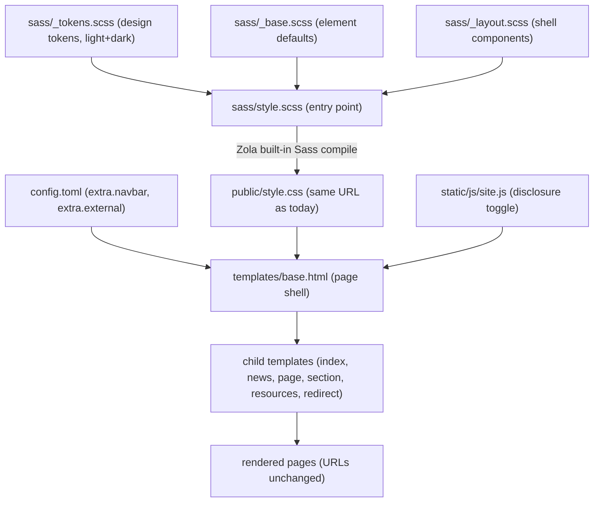
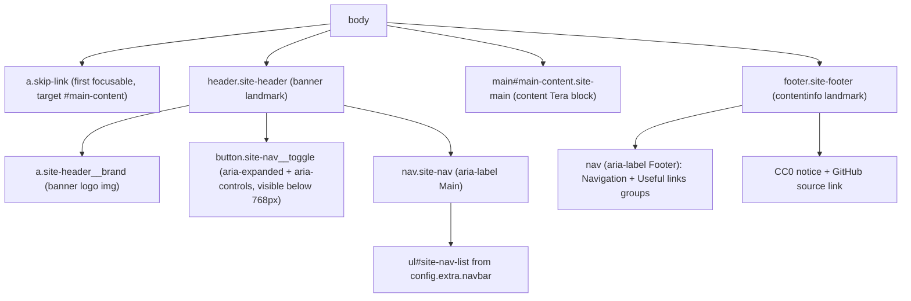

# Technical spec — FR-0001 · Design foundation and framework removal

> Source of truth for WHAT: `docs/Spec-0001—Rust-Edu-Website-Revitalization.md` (PRD). This spec covers HOW for FR-0001
> only. Referenced user stories: US-0001, US-0007. Complexity: **medium**. Generated in Batch mode — every decision the
> PRD did not answer was taken by the Auto-accept policy and is listed under "Assumptions / Decisions" for review.

## 1. Technical summary

**What.** Remove the two vendored CSS framework submodules (Bulma, Bulmaswatch) and every reference to them, and
replace them with a self-contained, hand-written style foundation compiled by Zola's built-in Sass pipeline: a single
design-token set (brand palette, semantic colors with light and dark variants, spacing scale, typography scale), base
element styles, and the shared page shell (header with logo and config-driven navigation, content area, footer with
link groups and the CC0 + source notice). The shell gains the accessibility skeleton (skip link, landmarks, visible
focus styles) and a responsive navigation that collapses below 768 px into an accessible disclosure menu driven by a
rewritten vanilla `site.js`. Dead presentation code is deleted. The site builds from a fresh clone with no submodule
step, all public URLs keep resolving, and compiled CSS stays at or under 50 KB uncompressed.

**Why.** The empty-checked-out submodules are the repository's top setup failure — `zola build` on a fresh clone fails
today with `Can't find stylesheet to import` (reproduced during pattern discovery). Every template is saturated with
framework class names, the framework markup has leaked into content, and the framework ships far more CSS than a site
of seven page types needs. A token-first, framework-free foundation is smaller, buildable anywhere Zola runs, and gives
FR-0002 (page templates) and FR-0003 (dark mode) a single place to consume design values from.

### Scope

**Included** (the FR has no Essential/Full split — full scope applies):

- Removal of the `ext/bulma` and `ext/bulmaswatch` submodules, `.gitmodules`, and every `ext/` import in `sass/`.
- Design-token set defined in one Sass partial: brand color constants, semantic color tokens with a light **and** a
  dark value each (dark values defined now, consumed by FR-0003), spacing scale, typography scale, misc tokens
  (radius, container measure, breakpoint constant).
- Base element styles (typography, links, lists, images, code, tables) consuming tokens only.
- Shared page shell in `templates/base.html`: skip link, landmark regions, branded header with the existing banner
  logo, centered readable content column, footer with Navigation / Useful links groups plus the CC0 and source notice.
- Config-driven navigation and footer links from the existing `config.extra.navbar` / `config.extra.external` entries
  (label, URL, order = array order); external URLs open in a new tab.
- Responsive behavior: single 768 px breakpoint; below it the navigation collapses into a toggleable disclosure menu
  with proper button semantics (`aria-expanded`, `aria-controls`), operable by mouse, touch, keyboard, and screen
  reader; rewritten `static/js/site.js` within the site-wide 10 KB JS budget; defined no-JS fallback.
- Visible focus styles on all interactive elements.
- Dead-code deletion: `templates/home.html` (never referenced by any content file) and the Font Awesome icon markup in
  `templates/macros.html` (the icon library is never loaded).
- Total compiled CSS ≤ 50 KB uncompressed (expected ~8–12 KB).
- URL stability: no content, slug, or asset-path changes; `/style.css` and `/js/site.js` keep their URLs.
- Minimal README correction: the submodule initialization step and its troubleshooting entry are removed so the
  documented quickstart matches reality (full README rewrite stays with FR-0008 — see decision D-10).

**Output contracts consumed by later FRs** (FR-0001 has no `Consumes`/`Provides` blocks in the PRD; these derive from
Section 8 "Foundational features"):

- **Design-token catalog** (Section 4.5) — consumed by FR-0002 (all page styling) and FR-0003 (dark palette).
- **Shell template contract** — `base.html` keeps the existing Tera block names `title`, `head`, `content`, so every
  child template continues to render; FR-0002 rebuilds children against these same blocks.
- **Navigation configuration contract** — the `config.extra.navbar` / `config.extra.external` entry shape stays
  `{ name, url }` with order given by array position; FR-0006 adds its Workshop entry by editing only `config.toml`.
- **Submodule-free build** — enables the ≤ 3-command quickstart documented by FR-0008 and simplifies FR-0007's CI.

**Deferred / not in this FR:**

- Rebuilding inner page templates (`index.html`, `news.html`, `page.html`, `section.html`, `resources.html`,
  `redirect.html`) — FR-0002. They stay untouched and keep extending `base.html` (see Transition strategy).
- Removing framework markup embedded in content files (`content/_index.md`) — FR-0002.
- Dark-mode activation: theme resolution, toggle, `prefers-color-scheme` binding — FR-0003 (FR-0001 only defines the
  dark token values, inert).
- CI workflow changes (`.github/workflows/main.yml`) — FR-0007.
- Full README/CONTRIBUTING rewrite and version-pinning single source of truth — FR-0007/FR-0008.
- Per-page meta descriptions and title refinement (NFR-0012) — FR-0002.

### Requirements / Business rules

Derived from the FR-0001 `Capabilities` block (PRD Section 6):

- R1 — After this FR, `git submodule status` reports nothing, `.gitmodules` does not exist, and `zola build` succeeds
  from a fresh clone with no extra step.
- R2 — Exactly one token definition point exists (`sass/_tokens.scss`); every color, spacing, and type-size value used
  by any other stylesheet comes from a token. Each semantic color token has a light and a dark value.
- R3 — Brand identity is preserved: `static/rust-edu-banner.svg` remains the header logo; the palette is built on
  charcoal `#2a3439`, yellow `#ffc832`, red `#a72145`, green `#0b7261`, purple `#2e2459`; no third-party font delivery
  (system font stack).
- R4 — The shell provides header (logo + navigation), content area, and footer (navigation links, external links, CC0
  notice, source link) on every page.
- R5 — Header and footer links render from `config.extra.navbar` / `config.extra.external` (label, URL, order);
  entries whose URL points off-site open in a new tab. Changing navigation touches only `config.toml`.
- R6 — Single breakpoint at 768 px. Below it the navigation collapses behind a toggle with real `<button>` semantics,
  exposed expanded/collapsed state, operable by mouse, touch, keyboard, and screen reader.
- R7 — Accessibility skeleton: skip-to-content link is the first focusable element; `header`, `nav`, `main`, `footer`
  landmarks; visible focus indicator on every interactive element.
- R8 — `templates/home.html` and the icon markup referencing the never-loaded icon library are deleted.
- R9 — Compiled `public/style.css` ≤ 51 200 bytes.
- R10 — Every URL the current deployed site serves keeps resolving unchanged.

### UX flows

From the FR-0001 `Experience` block:

- **Visitor, any device** — sees the branded header with the banner logo, reads content in a centered column capped at
  the readable measure, reaches every section from the header; below 768 px, opens the menu with the toggle button and
  the same entries appear stacked.
- **Keyboard user** — first Tab lands on "Skip to content" (visibly appearing on focus); activating it jumps focus to
  the main content. Otherwise tabbing proceeds skip link → brand link → (below 768 px) menu toggle → navigation links →
  content links → footer links, with a visible focus outline at every stop. The menu toggle opens with Enter/Space;
  Escape closes the open menu and returns focus to the toggle.
- **Screen-reader user** — lands on landmarks banner/navigation/main/contentinfo; the toggle announces its name
  ("Menu") and expanded/collapsed state.
- **Maintainer changing navigation** — edits one entry in `config.toml` (`[extra] navbar` or `external`), rebuilds, and
  the change appears in both header and footer. No template edits.

### Transition strategy (site must build and deploy after FR-0001 alone)

NFR-0011 requires every change to leave the site buildable. FR-0001 lands before FR-0002 rebuilds inner pages, so:

- `base.html` keeps the Tera block names `title`, `head`, and `content` unchanged — the six untouched child templates
  keep extending it and keep building (`redirect.html` depends on `head`; all depend on `title`/`content`).
- Framework class names remaining inside the untouched child templates and in `content/_index.md` become **inert**:
  after Bulma is gone no rule matches them, so those elements fall back to the new base element styles (headings,
  paragraphs, links are styled; grids/cards/notifications degrade to plain stacked blocks). Pages remain readable and
  functional but visually plain until FR-0002 — an accepted, documented interim state.
- The new base element styles are deliberately scoped to elements and `site-*`/`skip-link` classes only, so they
  cannot conflict with FR-0002's future class names.
- No content file, slug, or static asset moves; `sitemap.xml` output is expected to be identical before and after
  (verified — see T-A06).

### Applicable NFRs and how this FR meets them

| NFR | Requirement (abridged) | How FR-0001 meets it |
| --- | --- | --- |
| NFR-0001 | Zero third-party requests | Self-contained CSS, system font stack (no webfonts), first-party `site.js`, no CDN references anywhere in the shell |
| NFR-0002 | WCAG 2.1 AA | Skip link, landmarks, disclosure button semantics, `:focus-visible` outline, AA-checked token pairs (Section 4.6) |
| NFR-0003 | Latest 2 evergreen browsers | Only baseline-supported CSS (custom properties, flexbox, grid, `:focus-visible`, media queries); no legacy fallbacks shipped |
| NFR-0004 | CSS ≤ 50 KB, JS ≤ 10 KB | Token-first hand-written CSS (~8–12 KB expected, hard cap checked in T-S05); FR-0001 JS ≤ 2 KB of the 10 KB site-wide budget (allocation in D-05) |
| NFR-0005 | Lighthouse ≥ 95 ×4 | Minimal render-blocking CSS, no external requests, semantic landmarks; verified on the home page at this stage (full 5-page matrix once FR-0002 lands) |
| NFR-0006 | Only git + Zola 0.22.1 | Styles compiled by Zola's built-in Sass (`compile_sass = true`, existing pattern); no Node/npm introduced |
| NFR-0008 | Progressive enhancement | With JS disabled the navigation renders fully expanded (no-js fallback, D-05); all content readable; script only adds the collapse convenience |
| NFR-0010 | URL stability | No content/asset/slug changes; `/style.css` and `/js/site.js` paths preserved; sitemap diff check (T-A06) |
| NFR-0011 | Incremental delivery | Transition strategy above; every plan phase leaves `zola build` green |

### Observed codebase patterns (Step 1.3 discovery)

1. Zola 0.22.1 (matches local binary), `compile_sass = true`; Tera templates extend `base.html` through blocks
   `title`, `head`, `content`.
2. Content is Markdown + TOML frontmatter; per-page template selection via `template = "..."` in frontmatter.
3. Navigation/footer already config-driven through `config.extra.navbar` and `config.extra.external` (`{ name, url }`).
4. Vanilla JS only: one `static/js/site.js` loaded at end of body with a DOM-ready guard; toggles Bulma `is-active`
   classes on `.navbar-burger`/`#navMenu`.
5. Styling chain: `sass/style.scss` imports Bulmaswatch variables → `_variables.scss` → Bulma → Bulmaswatch overrides;
   the submodules are checked out empty locally, so a fresh clone does not build (reproduced).
6. Existing brand tokens in `sass/_variables.scss`: gray `#2a3439`, red `#a72145`, green `#0b7261`, purple `#2e2459`,
   yellow `#ffc832`, link `#4299bf`, `"Fira Sans"` family reference with no webfont shipped, 800 px container, 4 px
   radius, charcoal footer with white text and yellow links.
7. Bulma class names saturate all templates and have leaked into `content/_index.md`.
8. Dead code: `templates/home.html` referenced by nothing; Font Awesome markup in `macros.html` with no FA stylesheet
   loaded anywhere; `build_search_index = true` output unused (FR-0005 will consume it — left as-is).
9. Existing markup defect: the navbar burger `<a>` is nested inside the brand `<a>` in `base.html` (invalid HTML);
   the shell rebuild removes it.
10. CI deploys via unpinned `shalzz/zola-deploy-action@master` with `submodules: true` checkout — FR-0007 territory,
    untouched here.
11. `link_checker` already set to `internal = error` / `external = warn`; `minify_html = false`; custom domain via
    `static/CNAME` (`rust-edu.org`).

### Assumptions / Decisions (Auto-accept — review and override as needed)

Every entry was taken by the Batch-mode Auto-accept policy ("Technical decisions with a clear recommendation" row
unless noted). Section 3 details the trade-offs of the major ones.

- **D-01 · Tokens as CSS custom properties emitted from Sass.** Design tokens are CSS custom properties on `:root`
  (semantic tokens) generated from one Sass partial, compiled by Zola's built-in pipeline (existing codebase pattern).
  Custom properties are required for FR-0003's runtime theme switch; Sass remains only as the file-organization and
  compilation vehicle. The 768 px breakpoint is a build-time Sass constant because media queries cannot read custom
  properties.
- **D-02 · Dark palette defined now, inert until FR-0003.** Each semantic color token gets its dark value in the token
  partial, emitted under the `:root[data-theme="dark"]` scope, defined once in a reusable Sass construct so FR-0003
  can re-emit the same values inside a `prefers-color-scheme` media query without duplication. Nothing sets
  `data-theme` in FR-0001, so the site stays light — avoids shipping an unvalidated dark UI while inner pages are
  still in their interim plain state.
- **D-03 · System font stack.** The never-delivered `"Fira Sans"` reference is dropped; body text uses the modern
  system stack (`system-ui` first) and code uses the system monospace stack. Zero font requests (NFR-0001); visitors
  already saw fallback fonts today unless Fira Sans was installed locally.
- **D-04 · Class naming: semantic `site-*` blocks, BEM-lite, ARIA-keyed state.** Shell components use
  `site-header`, `site-nav`, `site-footer`, etc., with `block__element` for parts. Open/closed menu styling keys off
  `[aria-expanded]` on the toggle instead of a state class, so visual state can never drift from the state announced
  to assistive technology.
- **D-05 · Nav disclosure pattern and no-JS fallback.** A real `<button>` with `aria-expanded`/`aria-controls`
  controls the nav list (WAI-ARIA APG disclosure navigation pattern), including Escape-to-close with focus return.
  A tiny inline head script swaps a root `no-js` class for `js` before first paint; the collapsed-menu styles apply
  only under the `js` root class, so with JavaScript disabled the navigation renders fully expanded (NFR-0008).
  Accepted trade-off: if `site.js` itself fails to load, the button is inert (menu stays closed) — standard, low-risk
  failure mode for a same-origin ~1 KB script. JS budget allocation: FR-0001 ≤ 2 KB (toggle + bootstrap), reserving
  ~2 KB for FR-0003's theme toggle and the remainder for FR-0005's search script within the 10 KB site-wide cap.
- **D-06 · Sass file layout.** `sass/_variables.scss` is deleted and replaced by three partials — `_tokens.scss`,
  `_base.scss`, `_layout.scss` — imported by the rewritten `sass/style.scss`. The compiled output keeps the
  `/style.css` URL so `base.html`'s stylesheet link and the public asset path are unchanged.
- **D-07 · Link-color accessibility correction.** The inherited link blue `#4299bf` measures ~3.2:1 on white and
  fails WCAG AA for body text. The light-theme link token becomes `#2b7a9e` (same hue family, ≥ 4.5:1); the dark-theme
  link is `#6cb8dd`. (Policy row: partial PRD specification — the PRD fixes the five brand colors but not the link
  color, and the inherited value cannot satisfy AC-0002.05/NFR-0002.)
- **D-08 · Focus indicator.** 2 px solid outline with 2 px offset via `:focus-visible`; color token: brand purple
  `#2e2459` in light theme, brand yellow `#ffc832` in dark — both ≥ 3:1 against their page backgrounds.
- **D-09 · External-link handling and `$BASE_URL` removal.** Nav/footer templates treat an entry whose URL starts with
  an absolute `http(s)` scheme as external → `target="_blank"` plus `rel="noopener"`. The vestigial
  `replace(from='$BASE_URL', ...)` filter in the current templates is dropped: no entry in the repository's
  `config.toml` uses the placeholder, and removing it simplifies the contract (PRD "radical simplicity").
- **D-10 · Documentation and CI touch policy.** README gets only the minimal correction (remove the submodule step and
  its troubleshooting entry) so AC-0007.01/02 stop being false; the full rewrite including the pinned-version single
  source of truth stays with FR-0008/FR-0007. `.github/workflows/main.yml` is untouched — `submodules: true` checkout
  is a harmless no-op once `.gitmodules` is gone, and the workflow is FR-0007's scope (sibling Wave-1 spec; avoids
  cross-spec file conflicts).
- **D-11 · Spacing and type scales.** Spacing: 8 steps (0.25 / 0.5 / 0.75 / 1 / 1.5 / 2 / 3 / 4 rem). Type: 7 steps
  (0.875 / 1 / 1.125 / 1.25 / 1.5 / 1.875 / 2.25 rem) with line-height tokens 1.2 (headings) and 1.6 (body).
  Container measure 50 rem preserves the existing 800 px pattern; radius token keeps the existing 4 px.
- **D-12 · Interim rendering of untouched templates is accepted.** Child templates keep their now-inert framework
  classes until FR-0002; readable-but-plain inner pages are the documented transition state (see Transition strategy).

## 2. Architecture impact

Affected components (full paths; details in Section 4):

- `templates/base.html` — rebuilt page shell (only template that changes structurally).
- `templates/home.html` — deleted (dead code).
- `templates/macros.html` — icon markup removed.
- `sass/style.scss` — rewritten entry point; `sass/_tokens.scss`, `sass/_base.scss`, `sass/_layout.scss` — new;
  `sass/_variables.scss` — deleted.
- `static/js/site.js` — rewritten (disclosure toggle).
- `.gitmodules`, `ext/bulma`, `ext/bulmaswatch` — removed from the repository.
- `README.md` — minimal quickstart correction.
- Unchanged on purpose: `config.toml`, `.github/workflows/main.yml`, `static/rust-edu-banner.svg`, all content files,
  all other templates.

Build-time data flow:

Shell structure and landmarks:

## 3. Technical decisions

Only decisions the PRD did not answer. Full enumeration in Section 1 "Assumptions / Decisions"; the structurally
significant ones:

| Decision | Chosen approach | Alternative considered | Trade-off | Origin |
| --- | --- | --- | --- | --- |
| Token mechanism | CSS custom properties on `:root`, generated from one Sass partial via Zola's built-in pipeline | Pure Sass variables (compile-time only) | Custom properties cost nothing at this scale and are mandatory for FR-0003 runtime theming; Sass variables alone would force FR-0003 to duplicate every color | Auto-Accept (D-01); codebase pattern `compile_sass` |
| Dark-variant delivery | Dark values emitted inert under `:root[data-theme="dark"]`, defined once in a reusable Sass construct | Bind `prefers-color-scheme` now (partial dark mode before FR-0003) | No half-tested dark UI ships while inner pages are in transition; FR-0003 re-emits the same construct for the media binding | Auto-Accept (D-02); orchestrated scope boundary |
| Typography | System font stack, no webfonts | Self-host Fira Sans (subset WOFF2) | Loses the (never actually delivered) Fira Sans branding in exchange for zero font bytes, zero third-party requests, and no font-loading CLS | Auto-Accept (D-03); NFR-0001/NFR-0005 |
| Nav collapse pattern | `<button>` + `aria-expanded`/`aria-controls`, state styled off ARIA attribute; `no-js`→`js` root-class bootstrap; expanded nav as no-JS fallback | CSS-only `
/
` disclosure | Button pattern matches the PRD's "proper button semantics and expanded/collapsed state" verbatim and behaves cleanly at the desktop breakpoint; `details` needs overrides to stay open ≥ 768 px | Auto-Accept (D-05); PRD Capabilities wording |
| Link color | Darken light-theme link to `#2b7a9e` (dark theme `#6cb8dd`) | Keep inherited `#4299bf` | Slight hue shift vs. guaranteed AA body-text contrast (inherited value measures ~3.2:1 and fails) | Auto-Accept (D-07); NFR-0002 |
| File/URL continuity | Keep `sass/` + compiled `/style.css` and `/js/site.js` URLs; rename only the variables partial to `_tokens.scss` | Move styles to `static/style.css` (skip Sass) | Preserves the existing pipeline, template link, and public asset URLs (NFR-0010); partials keep the foundation navigable | Auto-Accept (D-06); codebase pattern |
| Sibling-file discipline | Leave `config.toml` and CI workflow untouched | Opportunistic cleanup (`submodules: true`, pinning) | Avoids conflicts with the sibling Wave-1 FR-0007 spec; stale checkout flag is a harmless no-op | Auto-Accept (D-10); Section 8 wave plan |

## 4. Component summary

### 4.1 Templates and scripts

| File path | New/Modified/Deleted | Purpose | Key responsibilities |
| --- | --- | --- | --- |
| `templates/base.html` | Modified (rebuilt) | Shared page shell | Skip link first in body; `header`/`nav`/`main`/`footer` landmarks; brand link with banner logo; nav toggle button; config-driven nav/footer rendering with external-link handling; preserves Tera blocks `title`, `head`, `content`; inline head snippet for the `no-js`→`js` root-class swap; loads `/style.css` and `/js/site.js` at their existing URLs; fixes the current invalid nested-anchor markup |
| `templates/macros.html` | Modified | Resource entry macro | Remove the `external-link-icon` span and its `fa-solid` icon element (icon library never loaded); keep the macro rendering title link, optional author, optional description so `resources.html` keeps working until FR-0002 |
| `templates/home.html` | Deleted | Dead code | Unreferenced by any content file (the root section renders through `templates/index.html`); PRD mandates deletion |
| `static/js/site.js` | Modified (rewritten) | Nav disclosure behavior | Bind the toggle button; flip `aria-expanded` on activation; close on Escape with focus returned to the toggle; keep the existing DOM-ready-guard loading pattern; total FR-0001 script ≤ 2 KB |
| `templates/index.html`, `news.html`, `page.html`, `section.html`, `resources.html`, `redirect.html` | Unchanged | Transition | Keep extending `base.html`; their framework classes go inert until FR-0002 (Transition strategy) |

Shell markup outline for `base.html` (structure, not code):

1. `html lang="en"` with class `no-js`; head: charset, viewport, inline root-class swap snippet, stylesheet link
   (unchanged `get_url` pattern), `head` block, `title` block (existing " - Rust Edu" suffix pattern preserved).
2. Body, in order: skip link (`skip-link`, href `#main-content`, text "Skip to content", visually hidden until
   focused) → `header.site-header` → `main#main-content.site-main` (negative tabindex so the skip target reliably
   receives focus; contains the `content` block inside the measured container) → `footer.site-footer` → script tag.
3. Header contains: brand link (`site-header__brand`, href = `config.base_url`, containing the banner `img` with
   descriptive alt text naming the destination, e.g. "Rust-Edu — home"); toggle `button.site-nav__toggle`
   (`type="button"`, accessible name "Menu", `aria-expanded="false"`, `aria-controls="site-nav-list"`, three
   CSS-drawn bar spans marked `aria-hidden`); `nav.site-nav` with `aria-label="Main"` wrapping
   `ul#site-nav-list.site-nav__list` iterating `config.extra.navbar`.
4. Footer contains: `nav` with `aria-label="Footer"` holding two headed groups — "Navigation" (iterates
   `config.extra.navbar`) and "Useful links" (iterates `config.extra.external`) — headings rendered as `h2` styled
   small; then the notice block with the CC0 link and the GitHub source link (both external → new tab).
5. External-link rule (nav and footer): URL starting with `http` scheme → `target="_blank" rel="noopener"`; the
   vestigial `$BASE_URL` replace filter is dropped (D-09).

### 4.2 Styles

| File path | New/Modified/Deleted | Purpose | Key responsibilities |
| --- | --- | --- | --- |
| `sass/style.scss` | Modified (rewritten) | Entry point | Charset declaration; import the three partials below; no `ext/` imports; compiles via Zola to `/style.css` |
| `sass/_tokens.scss` | New | Design tokens (single definition point) | Brand constants; semantic color tokens on `:root` (light values); dark values defined once in a reusable Sass construct and emitted under `:root[data-theme="dark"]`; spacing scale; type scale; line heights; font stacks; radius; container measure; breakpoint Sass constant |
| `sass/_base.scss` | New | Element defaults | Minimal reset (box-sizing, margin normalization); body typography and colors from tokens; headings, paragraphs, lists, blockquotes, code/pre, tables, images (`max-width: 100%`); link styles incl. hover underline (existing pattern); `:focus-visible` outline; skip-link hidden/revealed behavior; reduced-motion respect for any transition introduced |
| `sass/_layout.scss` | New | Shell components | `site-header` (flex row, brand + nav, sticky-free, bottom border); `site-nav` desktop row / sub-768 collapsed panel keyed on root `js` class and toggle `[aria-expanded]`; CSS-drawn toggle bars; `site-main` centered column at the 50 rem measure with spacing tokens; `site-footer` charcoal treatment (white text, yellow links) with link groups and notice |
| `sass/_variables.scss` | Deleted | Superseded | Replaced by `_tokens.scss`; its brand values migrate into tokens (Section 4.5) |

Selector conventions: element selectors + `site-*` block classes only; `block__element` for parts; state via
`[aria-expanded]` and the root `js`/`no-js` class; no utility-class system; no raw hex values outside `_tokens.scss`
(enforced by T-S04).

### 4.3 Repository and documentation

| File path | New/Modified/Deleted | Purpose | Key responsibilities |
| --- | --- | --- | --- |
| `.gitmodules` | Deleted | Submodule removal | Both entries (`ext/bulma`, `ext/bulmaswatch`) gone with the file |
| `ext/bulma`, `ext/bulmaswatch` | Deleted | Submodule removal | Gitlink entries removed from the index; `ext/` directory disappears from fresh clones |
| `README.md` | Modified (minimal) | Truthful quickstart | Remove installation step 3 ("Initialize Submodules") and the "Can't find stylesheet to import" troubleshooting entry; leave everything else to FR-0008 |
| `config.toml` | Unchanged | Contract preserved | `extra.navbar` / `extra.external` shape and values untouched (FR-0006 will add its entry here later) |
| `.github/workflows/main.yml` | Unchanged | FR-0007 scope | Stale `submodules: true` becomes a no-op; pipeline modernization is the sibling Wave-1 spec |
| `static/rust-edu-banner.svg`, `static/CNAME`, `content/**` | Unchanged | Brand + URL stability | AC-0001.04 / AC-0001.06 |

### 4.4 Navigation configuration contract (input consumed by the shell)

| Field | Type | Required | Semantics |
| --- | --- | --- | --- |
| `config.extra.navbar[]` | array of tables | Yes | Header nav and footer "Navigation" group; render order = array order |
| `config.extra.external[]` | array of tables | Yes | Footer "Useful links" group; render order = array order |
| `.name` | string | Yes | Link label, rendered verbatim |
| `.url` | string | Yes | Absolute (`http…` → treated as external, new tab + `rel="noopener"`) or site-relative path |

### 4.5 Design token catalog (defined in `sass/_tokens.scss`)

Brand constants (theme-invariant, from the PRD palette / AC-0001.04):

| Token | Value |
| --- | --- |
| `--brand-charcoal` | `#2a3439` |
| `--brand-yellow` | `#ffc832` |
| `--brand-red` | `#a72145` |
| `--brand-green` | `#0b7261` |
| `--brand-purple` | `#2e2459` |

Semantic color tokens (light on `:root`; dark under `:root[data-theme="dark"]`, inert until FR-0003):

| Token | Light | Dark | Used for |
| --- | --- | --- | --- |
| `--color-bg` | `#ffffff` | `#1f292e` | Page background (dark = deepened brand charcoal) |
| `--color-surface` | `#f5f6f7` | `#2a3439` | Raised blocks, `pre`/code background |
| `--color-text` | `#2a3439` | `#e8eced` | Body text |
| `--color-text-muted` | `#5a676e` | `#a7b4ba` | Secondary text (dates, captions) |
| `--color-link` | `#2b7a9e` | `#6cb8dd` | Links (D-07) |
| `--color-link-hover` | `#1f5e7c` | `#8ecbe8` | Link hover (underline kept per existing pattern) |
| `--color-border` | `#d4d9dc` | `#46535a` | Header rule, table borders |
| `--color-focus` | `#2e2459` | `#ffc832` | Focus outline (D-08) |
| `--color-footer-bg` | `#2a3439` | `#2a3439` | Footer stays brand charcoal in both themes |
| `--color-footer-text` | `#ffffff` | `#ffffff` | Footer body text |
| `--color-footer-link` | `#ffc832` | `#ffc832` | Footer links (existing identity preserved) |

Scale and misc tokens:

| Token group | Tokens and values |
| --- | --- |
| Spacing (`--space-1`…`--space-8`) | 0.25 / 0.5 / 0.75 / 1 / 1.5 / 2 / 3 / 4 rem |
| Type scale (`--text-sm`…`--text-3xl`) | 0.875 / 1 / 1.125 / 1.25 / 1.5 / 1.875 / 2.25 rem |
| Line heights | `--leading-tight: 1.2` (headings), `--leading-body: 1.6` |
| Font stacks | `--font-sans`: system-ui first, then platform fallbacks, ending sans-serif; `--font-mono`: `ui-monospace` first, ending monospace |
| Radius | `--radius: 4px` (existing value preserved) |
| Measure | `--container-max: 50rem` (existing 800 px preserved) |
| Breakpoint | Sass constant `$breakpoint-nav: 768px` (build-time only — media queries cannot read custom properties) |

### 4.6 Contrast design table (computed at design time; independently verified by T-N01)

| Pair | Theme | Approx. ratio | AA requirement |
| --- | --- | --- | --- |
| `--color-text` on `--color-bg` | Light | 12.7:1 | ≥ 4.5:1 |
| `--color-text` on `--color-bg` | Dark | 12.5:1 | ≥ 4.5:1 |
| `--color-link` on `--color-bg` | Light | 4.8:1 | ≥ 4.5:1 |
| `--color-link` on `--color-bg` | Dark | 6.7:1 | ≥ 4.5:1 |
| `--color-text-muted` on `--color-bg` | Light | 5.8:1 | ≥ 4.5:1 |
| `--color-text-muted` on `--color-bg` | Dark | 7.0:1 | ≥ 4.5:1 |
| `--color-footer-link` on `--color-footer-bg` | Both | 8.2:1 | ≥ 4.5:1 |
| `--color-footer-text` on `--color-footer-bg` | Both | 12.7:1 | ≥ 4.5:1 |
| `--color-focus` on `--color-bg` | Light | 13.9:1 | ≥ 3:1 (UI component) |
| `--color-focus` on `--color-bg` | Dark | 10.3:1 | ≥ 3:1 (UI component) |

## 5. API contracts

**N/A — justified skip.** This is a fully static site: FR-0001 exposes no runtime endpoints, accepts no requests, and
produces no machine-consumed payloads beyond the built HTML/CSS/JS. The only structured input contract is the
navigation configuration (Section 4.4), and the only cross-feature outputs are the token catalog, shell blocks, and
config contract (Section 1 "Output contracts"), none of which are APIs. The PRD declares no `Consumes`/`Provides`
blocks for FR-0001.

## 6. Data model

**N/A — justified skip.** No database exists in this architecture; persistence is the git repository itself. Content
model contracts (news frontmatter, resource entry schema) are owned by FR-0002, and FR-0001 deliberately touches no
content files.

## 7. Testing strategy

The repository has no test framework (static site; NFR-0006 forbids adding toolchains), so tests are specified as
named, reproducible verification checks: scripted shell checks plus structured manual audits. Each check has an ID;
acceptance checks trace to their PRD criterion. All shell checks run from the repository root against a fresh build.

### 7.1 Structural checks (unit-level)

| Check ID | Procedure (specification) | Expected result |
| --- | --- | --- |
| T-S01 | `zola build` on a fresh clone (no submodule init), assert exit code | Exit 0; today it exits non-zero with "Can't find stylesheet to import" |
| T-S02 | `git submodule status` output; existence of `.gitmodules` and `ext/` | All empty/absent |
| T-S03 | `grep -rn "ext/" sass/ templates/` | No matches (no framework imports or references) |
| T-S04 | `grep -rnE '#[0-9a-fA-F]{3,8}' sass/ --include='*.scss' \| grep -v _tokens.scss` | No matches — every color consumed via token (R2) |
| T-S05 | `wc -c < public/style.css` after build | ≤ 51200 bytes (NFR-0004; expected ~8–12 KB) |
| T-S06 | Byte count of `static/js/site.js` plus the inline head snippet in `base.html` | ≤ 2048 bytes for FR-0001 (allocation D-05); site-wide total ≤ 10240 (NFR-0004) |
| T-S07 | `grep -rnE 'class="[^"]*(is-\|has-\|navbar\|column\|card\|notification\|subtitle)' templates/base.html templates/macros.html` | No matches — FR-0001-owned templates are framework-free |
| T-S08 | `grep -rn "fa-" templates/ && grep -rn "external-link-icon" templates/` | No matches (dead icon markup gone) |
| T-S09 | `test ! -f templates/home.html && grep -rn "home.html" templates/ content/ config.toml` | File absent; no references |
| T-S10 | Grep `templates/base.html` for the Tera block names `title`, `head`, `content` | All three present (shell contract for child templates) |
| T-S11 | `grep -n "data-theme" sass/_tokens.scss` and `grep -rn "data-theme" templates/ static/js/` | Dark scope present in tokens; **no** template/script sets it (D-02 inertness) |

### 7.2 Acceptance checks (one per PRD AC; PRD reference column mandatory)

| Check ID | Description | PRD reference | Procedure and expected result |
| --- | --- | --- | --- |
| T-A01 | Zero third-party requests | AC-0001.01 | Serve the built site; capture the network log (browser devtools or headless) for `/`, `/news/`, `/news/announcement/`, `/resources/`, `/workshop/`, `/zulip/`: every request targets the site origin. Static complement: scan `public/` for external URLs in `link href`, `script src`, `img src`, CSS `url(...)`, `@font-face` — none (external `<a>` hyperlinks are allowed; they are navigation, not asset requests) |
| T-A02 | No submodules or vendored framework code | AC-0001.02 | T-S02 + T-S03 pass; `sass/` contains only the four hand-written project files |
| T-A03 | Responsive 320–1920 px, accessible collapse | AC-0001.03 | At 320 / 375 / 767 / 768 / 1024 / 1920 px: no horizontal scrolling, images scale within the column; below 768 px nav is collapsed behind the toggle and operable by mouse, touch, keyboard (Enter/Space/Escape) and screen reader (VoiceOver spot check: name "Menu", state announced); at ≥ 768 px full nav row, toggle not shown |
| T-A04 | Brand identity preserved | AC-0001.04 | Header renders `static/rust-edu-banner.svg`; `grep` `sass/_tokens.scss` for all five brand hex values `#2a3439`, `#ffc832`, `#a72145`, `#0b7261`, `#2e2459` — all present as tokens |
| T-A05 | Keyboard operability + visible focus | AC-0001.05 | Tab from page top: first stop is the skip link (becomes visible on focus; activating it moves focus to main content); every interactive element (brand, toggle, nav links, in-content links, footer links) reachable and shows the 2 px outline; no focus trap |
| T-A06 | URL stability | AC-0001.06 | Build the pre-change site (submodules initialized or CI artifact) and the post-change site; diff the emitted URL sets (`sitemap.xml` plus the file listing of `public/`): no URL present before is missing after; `/style.css` and `/js/site.js` still exist |
| T-A07 | Fresh clone to running site, ≤ 3 commands, no submodule step | AC-0007.01 | On a clean directory: clone, `cd`, `zola serve` (Zola 0.22.1 preinstalled per README requirements) — site serves at the documented address; at no point is a submodule command required |
| T-A08 | README quickstart matches actual steps | AC-0007.02 | README contains no submodule initialization instruction and no stylesheet-import troubleshooting; executing its quickstart verbatim succeeds. Coverage note: the "single pinned generator version stated" half of this AC is completed by FR-0007 (single source of truth) + FR-0008 (rewrite); FR-0001 only stops the README from being wrong |
| T-A09 | Local build reproduces CI build | AC-0007.03 | Two consecutive local `zola build` runs at the same commit produce identical output (directory diff); the submodule-state divergence source is gone (build no longer depends on `ext/` contents). Coverage note: full local-vs-CI parity (pinned CI generator) is owned by FR-0007 |

### 7.3 NFR verification checks

| Check ID | NFR | Procedure and expected result |
| --- | --- | --- |
| T-N01 | NFR-0002 | Run an axe scan (browser extension or equivalent) on the home page: zero violations for landmarks, button-name, color-contrast, focus; independently verify the Section 4.6 pairs with a contrast checker |
| T-N02 | NFR-0005 | Lighthouse on the built home page (served locally or on the deploy preview): ≥ 95 in all four categories. Coverage note: the full 5-page matrix applies once FR-0002 rebuilds inner pages |
| T-N03 | NFR-0008 | Disable JavaScript; reload at 375 px and 1024 px: all content readable, navigation fully expanded and usable, no broken layout, no inert-looking dead control except the absent collapse behavior |
| T-N04 | NFR-0003 | Spot-check latest Chrome, Firefox, Safari (desktop + one mobile emulation): identical layout and working toggle; all CSS features used are baseline in the last 2 evergreen versions |

### 7.4 Integration tests

**N/A — justified skip.** FR-0001 has no `Consumes` block and therefore no `IC-NNNN.MM` integration criteria in the
PRD (Section 6). Downstream consumption of this FR's outputs (tokens by FR-0003, shell by FR-0002, config contract by
FR-0006) is verified by those FRs' own integration criteria when they are implemented.

### 7.5 Validation traceability summary

- AC-0001.01 → T-A01 · AC-0001.02 → T-A02 · AC-0001.03 → T-A03 · AC-0001.04 → T-A04 · AC-0001.05 → T-A05 ·
  AC-0001.06 → T-A06 · AC-0007.01 → T-A07 · AC-0007.02 → T-A08 (partial, shared with FR-0007/FR-0008) ·
  AC-0007.03 → T-A09 (partial, shared with FR-0007).
- NFR-0001 → T-A01 · NFR-0002 → T-N01/T-A05 · NFR-0003 → T-N04 · NFR-0004 → T-S05/T-S06 · NFR-0005 → T-N02 ·
  NFR-0006 → T-A07 (no extra toolchain appears) · NFR-0008 → T-N03 · NFR-0010 → T-A06 · NFR-0011 → T-S01 after every
  plan phase.
