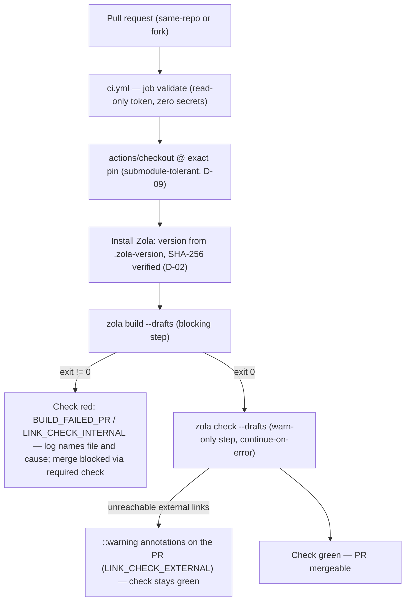
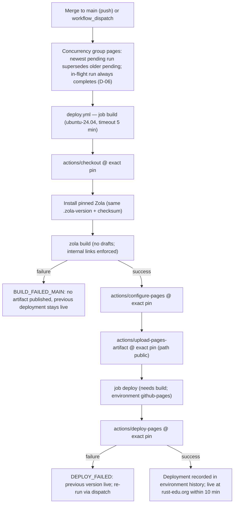

# Technical spec — FR-0007 · Deployment pipeline modernization and PR validation

> Source of truth for WHAT: `docs/Spec-0001—Rust-Edu-Website-Revitalization.md` (PRD). This spec covers HOW for FR-0007
> only. Referenced user stories: US-0007, US-0008. Complexity: **medium**. Generated in Batch mode — every decision the
> PRD did not answer was taken by the Auto-accept policy and is listed under "Assumptions / Decisions" for review.

## 1. Technical summary

**What.** Replace the current single CI workflow — which builds and deploys through the unpinned third-party
`shalzz/zola-deploy-action@master` and publishes by pushing to a `gh-pages` branch — with two purpose-built workflows
that use only GitHub-maintained actions pinned to exact released versions: a PR validation workflow (full site build
including drafts, blocking internal link check, warn-only external link check) and a deployment workflow (build on
merge to `main`, publish through the official GitHub Pages artifact/deployment flow, manual re-run via dispatch,
newest-wins concurrency). The site generator version (Zola 0.22.1, matching the locally verified binary) becomes
pinned in a single source-of-truth file that CI reads and that FR-0008's documentation will cite; CI installs that
exact version by downloading the official release binary and verifying its SHA-256 checksum — no third-party action in
the supply chain. A one-time, operator-performed repository settings migration (Pages source: `gh-pages` branch →
GitHub Actions; required status check on `main`; eventual `gh-pages` branch deletion) completes the cutover; those
steps are specified here as an explicit runbook because workflow files alone cannot change repository settings.

**Why.** Deployment today depends on a mutable third-party ref (`@master`) — the build recipe can change or be
compromised upstream without any change in this repository — and on whatever Zola version that action happens to ship,
so local builds and CI builds can silently diverge (the README even documents an unpinned `cargo install zola`).
PR validation exists (build-only mode with `--drafts`) but nothing makes a red check actually block a merge, external
links are never checked in CI despite `config.toml` already declaring the intended policy
(`internal_level = "error"`, `external_level = "warn"`), and a failed deploy has no documented recovery path. The
official Pages actions flow gives atomic deployments (a failed build or deploy leaves the previous deployment live),
an auditable environment history, least-privilege OIDC-based publishing, and removes the `gh-pages` branch
indirection entirely.

### Scope

**Included** (the FR has no Essential/Full split — full scope applies):

- New PR validation workflow `.github/workflows/ci.yml`: on every pull request (and on manual dispatch), install the
  pinned Zola, run a blocking full build including drafts (build errors and broken internal links fail the check with
  the offending file in the log), then a warn-only external link check surfaced as GitHub warning annotations.
- New deployment workflow `.github/workflows/deploy.yml`: on push to `main` (and on manual dispatch), build the
  production site (no drafts) and publish it via the official Pages flow (`actions/configure-pages` →
  `actions/upload-pages-artifact` → `actions/deploy-pages`), with the `github-pages` environment recording every
  deployment and newest-wins concurrency across consecutive merges.
- Single source of truth for the generator version: new root file `.zola-version` (content: `0.22.1`), read by both
  workflows and consumable by FR-0008's documentation; companion integrity pin `.zola-version.sha256` for the CI
  download (standard `sha256sum --check` format).
- Removal of `.github/workflows/main.yml` and with it the third-party deploy action and the `gh-pages` push model.
- Minimal README correction: the build-status badge currently points at `workflows/main.yml` and would break; it is
  repointed to the new deploy workflow (full README rewrite stays with FR-0008 — same minimal-touch precedent as
  FR-0001's D-10).
- Transition tolerance: the checkout steps keep `submodules: true` so the pipeline builds correctly whether it merges
  before or after FR-0001 removes the submodules (see D-09); a documented cleanup drops the flag once FR-0001 is on
  `main`.
- Operator runbook (Section 4.5): Pages source switch, custom-domain (`rust-edu.org`) and HTTPS verification, required
  status check configuration (what actually makes a red check block a merge), ordered `gh-pages` decommissioning.
- Structural enforcement of the ≤ 10 minute merge-to-live requirement: pinned runner and explicit per-job timeouts.

**Output contracts provided to later FRs** (from the FR-0007 `Provides` block — build/deploy workflow facts consumed
by FR-0008):

- **Pinned generator version, single source of truth** — `.zola-version` (Section 4.4). FR-0008's README/CONTRIBUTING
  must cite this file (not a hardcoded copy) so documentation and CI cannot disagree (AC-0008.02; verified from the
  consumer side by IC-0008.03).
- **Validation command facts** — the exact commands PRs are validated with: `zola build --drafts` (blocking) and
  `zola check --drafts` (warn-only externals). FR-0008 documents "what the PR checks verify and how to read a
  failure" against these facts.
- **Checks inventory** — the required status check identity (workflow `CI`, job `validate`) that branch protection
  enforces and contributor docs can name.

FR-0007 has **no `Consumes` block** in the PRD, and therefore no `IC-NNNN.MM` integration criteria belong to it
(Section 7.4 justifies the empty integration-test section).

**Deferred / not in this FR:**

- README/CONTRIBUTING rewrite citing the pinned version and explaining the checks — FR-0008 (only the broken badge is
  corrected here).
- Content-contract validation semantics (what makes a news post malformed) — FR-0002 defines the contracts; this
  pipeline surfaces their violations because `zola build` fails on them (AC-0006.04 is verified under FR-0002/FR-0008).
- PR preview deployments (deploying PR builds to a preview URL) — not requested by the PRD; out of scope.
- Scheduled external-link sweeps — explicitly excluded by PRD Section 9 ("no automated liveness monitoring beyond the
  CI warning check"); maintainers get on-demand sweeps via manual dispatch of the CI workflow instead (D-07).
- Automated action-version update tooling (e.g., Dependabot) — not in the PRD; version bumps remain deliberate,
  reviewed changes.
- Fixing the `config.toml` `base_url` / custom-domain mismatch — noted for FR-0002/FR-0004 (canonical URLs, feed
  links); deployment behavior is unaffected (D-13).

### Requirements / Business rules

Derived from the FR-0007 `Capabilities` block (PRD Section 6):

- R1 — Every `uses:` reference in `.github/workflows/` resolves to a GitHub-maintained action (`actions/*`
  organization) pinned to an exact released version tag; the third-party deploy action is gone from the repository.
- R2 — Zola is pinned exactly at 0.22.1 in `.zola-version`, the only place the version is defined; both workflows
  install from it, and documentation (FR-0008) cites the same file.
- R3 — Every pull request runs a full site build including drafts plus the internal link check, and a failure blocks
  the merge (via the required status check configured in the runbook) with the cause and offending file in the log;
  external links are checked warn-only and never block.
- R4 — Every merge to `main` builds and deploys automatically; when merges queue up, intermediate pending runs are
  superseded and the newest commit is what ends up deployed, while an in-flight deployment is never cancelled
  mid-publish.
- R5 — A maintainer can re-run the build-and-deploy pipeline for the current `main` without pushing a commit (manual
  dispatch), covering deploy-failure recovery.
- R6 — Merge-to-live is at most 10 minutes, enforced structurally by job timeouts and verified by measurement
  (T-A08).

### UX flows

From the FR-0007 `Experience` block (the "users" of a pipeline are contributors and maintainers):

- **Contributor opens a PR** — within minutes the PR shows the `validate` check: green when the site builds and all
  internal links resolve; red with the failing file and cause in the step log otherwise (Zola's error output names the
  source file for both build errors and broken internal links). Unreachable external links appear as warning
  annotations on the check without turning it red. Fork-based PRs behave identically to same-repo PRs (D-08).
- **Maintainer merges** — the deploy workflow starts automatically; the deployment appears under the repository's
  `github-pages` environment history, and the change is live on `rust-edu.org` within minutes (≤ 10 by requirement).
  Consecutive merges in a short window resolve to the newest one deployed.
- **Maintainer recovers from a failed deploy** — opens the Actions tab, triggers the deploy workflow manually (or
  re-runs the failed run); no new commit is needed; the site keeps serving the previous deployment until the re-run
  succeeds.
- **Maintainer curates external links** (supports AC-0009.04 consumers) — manually dispatches the CI workflow at any
  time to get a fresh external-link warning report without opening a PR.

### Error handling (stable codes from the PRD's FR-0007 Error handling block)

| Code | Trigger | Observable behavior (PRD contract) | Mechanism in this design | Recovery |
| --- | --- | --- | --- | --- |
| `BUILD_FAILED_PR` | `zola build --drafts` exits non-zero in the CI workflow | Check is red, merge is blocked, the log identifies file and cause; the live site is untouched | The blocking build step fails the `validate` job; branch protection (runbook step 12) makes the red check block merging; the CI workflow has no deploy permissions at all | Contributor fixes the file and pushes; the per-PR concurrency group cancels the superseded run |
| `BUILD_FAILED_MAIN` | Build job of the deploy workflow fails after a merge | No artifact is published, the previous deployment stays live, the failure is visible in the repository checks | Deploy job is gated on the build job (`needs`); a failed build never reaches artifact upload or deployment; the commit shows a red check on `main` | Fix-forward commit or revert; deploy runs again on the next push |
| `DEPLOY_FAILED` | Build succeeds but the Pages deployment step fails | The previous version remains live; the deployment can be re-run manually without a new commit | Pages deployments are atomic server-side — a deployment that does not complete leaves the prior one serving; `workflow_dispatch` re-runs from `main` HEAD | Manual dispatch of the deploy workflow, or "Re-run failed jobs" on the failed run |
| `LINK_CHECK_INTERNAL` | A broken internal link anywhere in the site | The build fails listing each offending link and its source file | `config.toml` already sets `internal_level = "error"`, so `zola build` itself fails and its output enumerates link and file; blocking in PRs and on `main` alike | Fix the link; the same message appears locally with the same pinned Zola |
| `LINK_CHECK_EXTERNAL` | An external link is unreachable during the PR check | A warning annotation is emitted; the build proceeds | Separate `zola check --drafts` step: `external_level = "warn"` keeps Zola's exit green; the step converts Zola warning lines to GitHub `::warning` annotations and is additionally marked continue-on-error so even a tool-level failure (network flake, timeout) cannot block | None required; warnings feed curation (FR-0009) |

### Applicable NFRs and how this FR meets them

| NFR | Requirement (abridged) | How FR-0007 meets it |
| --- | --- | --- |
| NFR-0006 | Local dev needs only git + pinned Zola 0.22.1 | The pin lives in `.zola-version`, matching the locally used binary; CI adds zero local tooling (checksum file and workflows are CI-only); the documented 3-command quickstart is unaffected |
| NFR-0007 | Only GitHub-maintained actions, everything pinned exactly, identical inputs → identical sites | All `uses:` refs are `actions/*` at exact version tags (R1, T-S02); Zola installed at the exact pinned version with SHA-256 verification (D-02); pinned runner image (D-11); local and CI builds run the same generator version, so the same commit produces the same site (T-A09, T-N01) |
| NFR-0010 | All public URLs keep resolving | The deployment model changes, the published content and domain do not: same build output, `static/CNAME` retained, custom domain verified in the runbook; no URL is affected |
| NFR-0011 | Small, independently reviewable changes; site always buildable/deployable | FR-0007 lands as one focused PR; the old pipeline serves until the merge instant, the new one takes over after; the transition window (runbook) keeps the previous deployment live throughout; either FR-0001 merge order is safe (D-09) |

### Observed codebase patterns (Step 1.3 discovery)

1. Current CI: single `.github/workflows/main.yml`, `on: push [main]` + `pull_request`, two jobs split by an
   `if: github.ref` condition; `actions/checkout@v3.0.0` with `submodules: true`; third-party
   `shalzz/zola-deploy-action@master` (mutable ref) — PR path `BUILD_ONLY: true` + `BUILD_FLAGS: --drafts`, main path
   `PAGES_BRANCH: gh-pages`; `GITHUB_TOKEN` handed to the third-party action in both paths.
2. Deployment model: built site pushed to a `gh-pages` branch; repository Pages source is "Deploy from a branch". No
   `permissions:` blocks, no `concurrency:`, no `workflow_dispatch`, no timeouts anywhere.
3. No Zola version pinned anywhere (README says `cargo install zola`; the deploy action ships its own build); local
   binary is 0.22.1 — the PRD's pin target.
4. `config.toml` already encodes the intended link policy: `[link_checker] internal_level = "error"`,
   `external_level = "warn"` — consumed as-is by this design (D-14). `build_search_index = true` (FR-0005's concern).
5. Custom domain via `static/CNAME` = `rust-edu.org`; `base_url = "https://rust-edu.github.io"` in `config.toml` — a
   latent canonical-URL mismatch outside this FR's scope (D-13).
6. Submodules `ext/bulma` / `ext/bulmaswatch` with public HTTPS URLs (fork-safe checkout); FR-0001's approved sibling
   spec removes them and explicitly leaves `main.yml` untouched for FR-0007 (their D-10), noting `submodules: true`
   becomes a harmless no-op once `.gitmodules` is gone.
7. README carries a build badge tied to the `main.yml` filename; FR-0001 set the precedent of minimal, truthfulness
   README corrections with the rewrite deferred to FR-0008.
8. No test framework exists (static site); the sibling spec established the named-verification-check pattern
   (T-Sxx/T-Axx/T-Nxx) reused here.
9. Content currently has no `draft = true` pages, but the current PR build already passes `--drafts` — the AC keeps
   that behavior mandatory (full build including drafts).
10. This working repository is a fork (`origin` = kenesparta/rust-edu.github.io; upstream = rust-edu org) — the full
    migration can be rehearsed end-to-end on the fork (own Pages site + settings) before the upstream PR (Section 7
    uses this).
11. Delivery plan context: PR ordering places FR-0001 before FR-0007, but the PRD allows either order for the two
    Wave-1 foundationals; this design tolerates both (D-09).

### Assumptions / Decisions (Auto-accept — review and override as needed)

Every entry was taken by the Batch-mode Auto-accept policy ("Technical decisions with a clear recommendation" row
unless noted). Section 3 details the trade-offs of the structurally significant ones.

- **D-01 · Official GitHub Pages actions flow, exact release-tag pins.** Deployment uses `actions/checkout`,
  `actions/configure-pages`, `actions/upload-pages-artifact`, and `actions/deploy-pages` — all GitHub-maintained, each
  pinned to an exact released version tag (`vX.Y.Z`, never a floating major and never a branch ref). Pin targets
  known-good at spec time: `checkout@v4.2.2`, `configure-pages@v5.0.0`, `upload-pages-artifact@v3.0.1`,
  `deploy-pages@v4.0.5`; the implementer verifies the current exact releases at implementation time and pins those.
  Commit-SHA pinning was considered (stricter: tags are technically mutable) and set aside: NFR-0007's letter asks for
  exact versions, the actions share GitHub's own trust domain, and readable tags keep review friction low for a
  volunteer-maintained repo.
- **D-02 · Zola installed by direct download with checksum verification.** A plain `run` step downloads the official
  Linux x86-64 release asset for the pinned version from the Zola project's GitHub releases
  (asset naming pattern `zola-v<version>-x86_64-unknown-linux-gnu.tar.gz`), verifies it against the pinned SHA-256 in
  `.zola-version.sha256` using `sha256sum --check` (fail-closed: any mismatch or missing entry aborts), extracts the
  binary onto the runner's PATH, and asserts `zola --version` reports the pinned version. No third-party
  installer action exists in the supply chain. The expected checksum is computed once from the official release asset
  at implementation time and committed — this spec deliberately does not invent the value.
- **D-03 · `.zola-version` as the single source of truth.** A new root file containing exactly the version string
  (`0.22.1`, single line). Both workflows read it to build the download URL and to assert the installed version;
  FR-0008's documentation cites the file rather than hardcoding a copy (AC-0008.02; consumer-verified by IC-0008.03).
  The file holds version identity only — integrity data lives in the companion `.zola-version.sha256` so the
  docs-facing contract stays a bare version string. A version bump edits exactly these two files; forgetting either
  one makes the install step fail loudly (checksum mismatch or missing checksum entry), so the pair cannot silently
  drift.
- **D-04 · Two workflows replace the one legacy file.** `ci.yml` (PR validation) and `deploy.yml` (build + deploy)
  replace `main.yml`, giving each concern its own least-privilege permissions block, its own concurrency semantics,
  and a clear name in the checks UI, instead of one file gated by `if: github.ref` conditions. Consequence: the README
  build badge referencing `main.yml` would break, so it is repointed to `deploy.yml` as a minimal correction
  (precedent: FR-0001's D-10 minimal README touch; the rewrite remains FR-0008's).
- **D-05 · Blocking / warn-only mapping onto `zola build` vs `zola check`.** Zola enforces internal links during
  `build` (per `internal_level = "error"` already in `config.toml`) but only contacts external URLs during `check`.
  Therefore the PR job runs two steps: (1) `zola build --drafts` — blocking; catches build errors (`BUILD_FAILED_PR`)
  and broken internal links (`LINK_CHECK_INTERNAL`) in one step, exactly mirroring what a merge to `main` would need;
  (2) `zola check --drafts` — external links; `external_level = "warn"` keeps unreachable externals as warnings with
  a green exit, the step pipes Zola's warning lines into GitHub `::warning` workflow commands so they surface as
  annotations on the PR (the PRD's `LINK_CHECK_EXTERNAL` contract), and the step is marked continue-on-error as a
  belt-and-braces guarantee that even a crash or network-level failure of the checker cannot block a merge. The
  deploy path builds without `--drafts` (production excludes drafts) and runs no external check (warnings belong in
  PRs and on-demand sweeps, not between a merge and its deployment).
- **D-06 · Concurrency: newest wins, deployments never cancelled mid-flight.** The deploy workflow uses a single
  fixed concurrency group with cancel-in-progress disabled: an in-flight run always completes (a half-cancelled
  deployment would violate AC-0008.04's spirit), and because a concurrency group keeps at most one pending run —
  newer pending runs supersede older pending ones — a burst of consecutive merges resolves to the newest commit
  deployed, exactly the PRD's "concurrent merges resolve to the newest deployment". The CI workflow uses a per-ref
  group with cancel-in-progress enabled: a new push to a PR cancels the now-obsolete validation run.
- **D-07 · Manual dispatch on both workflows; no schedules.** `workflow_dispatch` on `deploy.yml` satisfies "manual
  re-run/re-deploy without pushing a new commit" (R5, `DEPLOY_FAILED` recovery). It is also added to `ci.yml` so
  maintainers can run an on-demand external-link sweep for curation (feeds AC-0009.04's warning consumers) — one
  trigger line, no new machinery. No `schedule` trigger anywhere: PRD Section 9 explicitly excludes automated link
  liveness monitoring beyond the CI warning check.
- **D-08 · Least privilege and fork-PR posture.** `ci.yml` declares workflow-level `permissions: contents: read` and
  references no secrets at all — so PRs from forks (which receive a read-only `GITHUB_TOKEN` and no secrets) run the
  identical validation path with no degradation, and a malicious PR gains nothing (it can at most burn minutes; it
  cannot write to the repo or deploy). The trigger stays plain `pull_request` (never `pull_request_target`, which
  would run PR-influenced code with elevated permissions). `deploy.yml` declares the official Pages permission triple
  (`contents: read`, `pages: write`, `id-token: write`) at workflow level — it only ever runs on `push` to `main` or
  manual dispatch by a collaborator, never on PR events.
- **D-09 · Submodule-checkout tolerance during the Wave-1 transition window.** Both checkout steps set
  `submodules: true` at introduction: if FR-0007 merges before FR-0001, the Sass entry point still imports `ext/`
  and the build needs the submodules (the official checkout action defaults to not fetching them); if FR-0001 merges
  first, the flag is a harmless no-op on a repo with no `.gitmodules` (confirmed stance in FR-0001's spec). Working
  assumption, documented per instructions: the delivery plan merges FR-0001 first, but nothing here depends on it —
  the workflow is correct in both orders. Once FR-0001 is on `main`, a one-line cleanup removes the flag from both
  workflows (plan step 13) so the files do not carry dead configuration.
- **D-10 · Operator runbook for what workflow files cannot do.** Three repository-settings actions are explicit,
  ordered operator steps (Section 4.5): switching the Pages source from the `gh-pages` branch to GitHub Actions
  (with `actions/configure-pages`' enablement input as an automation assist on first run — the operator still
  verifies), marking the `validate` job as a required status check on `main` (without branch protection a red check
  does not actually block merging — AC-0008.03's "blocks the merge" is operationally enforced here), and deleting the
  `gh-pages` branch only after a verified Actions deployment (deleting it earlier, while it is still the Pages
  source, would take the live site down). Custom domain (`rust-edu.org`) and enforced HTTPS are verified to have
  survived the source switch — under the Actions model the domain is governed by the Pages settings, and
  `static/CNAME` is retained as harmless insurance and documentation.
- **D-11 · Pinned runner and explicit timeouts.** Jobs run on an explicitly versioned runner image (`ubuntu-24.04`)
  rather than the floating `ubuntu-latest` label — same exact-pin philosophy as everything else, and it guarantees the
  x86-64 architecture the pinned checksum is computed for (an image/arch change fails loudly at checksum time instead
  of deploying something unverified). Every job carries `timeout-minutes`: 5 for each deploy-workflow job (structural
  ceiling under the 10-minute merge-to-live budget; measured expectation is ~2–4 minutes total) and 10 for the CI job
  (external link checking is network-bound and slower).
- **D-12 · `configure-pages` included in the build job.** It is part of the official flow, GitHub-maintained, and its
  enablement input lets the first run flip the repository's Pages build type to the Actions model, shrinking the
  transition window (D-10 still keeps the operator verification step authoritative). Its SSG-specific base-URL
  injection features are not used — Zola's `base_url` comes from `config.toml`.
- **D-13 · `base_url` mismatch flagged, not fixed.** `config.toml` declares `base_url = "https://rust-edu.github.io"`
  while the site serves at `rust-edu.org` (CNAME). This affects canonical/absolute URL generation (sitemap, future
  feed), not deployment; changing it belongs with FR-0002/FR-0004 (canonical links, feed entries). Recorded here so
  the flag is not lost. (Policy row: overly vague / partial PRD area — the PRD fixes no owner for this pre-existing
  inconsistency; the recommendation is to leave FR-0007's scope clean.)
- **D-14 · `config.toml` link-checker settings consumed as-is.** `internal_level = "error"` / `external_level =
  "warn"` already encode the PRD's blocking/warn split at the tool level; this FR makes CI rely on them (D-05) and
  changes nothing in `config.toml` (also avoids file conflicts with the sibling FR-0001, which declares
  `config.toml` unchanged).

## 2. Architecture impact

Affected components (full paths; details in Section 4):

- `.github/workflows/ci.yml` — new: PR validation workflow (blocking build + warn-only external links).
- `.github/workflows/deploy.yml` — new: build-and-deploy workflow (official Pages flow).
- `.github/workflows/main.yml` — deleted: legacy third-party pipeline.
- `.zola-version` — new: pinned generator version, single source of truth (provided to FR-0008).
- `.zola-version.sha256` — new: pinned SHA-256 for the CI-downloaded release asset.
- `README.md` — minimal correction: build badge repointed from `main.yml` to `deploy.yml`.
- Repository settings (not files; operator runbook 4.5): Pages source, required status check, `gh-pages` deletion.
- Unchanged on purpose: `config.toml` (link checker, search index), `static/CNAME`, all templates, styles, content,
  and everything FR-0001 owns.

PR validation flow:

Deployment flow:

## 3. Technical decisions

Only decisions the PRD did not answer. Full enumeration in Section 1 "Assumptions / Decisions"; the structurally
significant ones:

| Decision | Chosen approach | Alternative considered | Trade-off | Origin |
| --- | --- | --- | --- | --- |
| Deployment model | Official Pages artifact flow (`configure-pages` → `upload-pages-artifact` → `deploy-pages`), environment `github-pages` | Keep branch-based publishing with a first-party push step to `gh-pages` | Requires the one-time settings migration and runbook, in exchange for atomic deployments, environment history, OIDC least privilege, and no long-lived publishing branch | Auto-Accept (D-01); PRD Capabilities "only GitHub-maintained actions" |
| Action pinning depth | Exact released version tags (`vX.Y.Z`) | Commit-SHA pins | Tags are mutable in theory; accepted because the actions are in GitHub's own trust domain and NFR-0007 asks for exact versions — SHA pins would cost readability for a volunteer repo | Auto-Accept (D-01); NFR-0007 |
| Generator provisioning | Direct download of the official release binary, SHA-256 verified against a repo-pinned checksum | Third-party setup action; `cargo install zola` in CI | A few lines of shell to own, in exchange for zero third-party supply chain and no multi-minute compile; checksum pin makes the artifact tamper-evident | Auto-Accept (D-02); NFR-0007 |
| Version source of truth | `.zola-version` file (bare version string) + `.zola-version.sha256` companion | Version env var duplicated in both workflows; version+checksum in one file | Two tiny root files, in exchange for a clean docs-citable contract (FR-0008 / IC-0008.03) and a fail-closed bump procedure with no cross-workflow drift | Auto-Accept (D-03); AC-0008.02 |
| Workflow topology | Two workflows (`ci.yml`, `deploy.yml`) replacing `main.yml`; README badge repointed | One workflow with ref-conditional jobs (status quo shape) | One extra file and a badge touch, in exchange for per-workflow least-privilege permissions, independent concurrency semantics, and dispatch that targets only the deploy path | Auto-Accept (D-04) |
| Blocking vs warn split | `zola build --drafts` = blocking (build + internal links); separate `zola check --drafts` step = warn-only externals with `::warning` annotations + continue-on-error | Single `zola check` for everything; or a separate non-required job for externals | The check step re-validates internal links redundantly (harmless); a separate failing job would render a scary red X and make "non-blocking" depend on protection config — the in-job warn-only step keeps one clear required check | Auto-Accept (D-05); AC-0008.03, config.toml pattern |
| Consecutive merges | Fixed concurrency group, cancel-in-progress disabled (pending-run replacement ⇒ newest wins) | cancel-in-progress enabled | An in-flight older deploy completes before the newest starts (seconds of delay) instead of risking a cancelled half-deployment; final state is always the newest commit | Auto-Accept (D-06); PRD Capabilities |
| Transition tolerance | Keep `submodules: true` in checkouts until FR-0001 is on `main`, then remove | Omit the flag and require FR-0001 to merge first | Carries a soon-dead flag for a short window, in exchange for correctness under either Wave-1 merge order | Auto-Accept (D-09); sibling FR-0001 spec |
| Runner image | Pinned `ubuntu-24.04` | Floating `ubuntu-latest` | Needs a deliberate bump when the image retires, in exchange for a stable, checksum-matching architecture and exact-pin consistency | Auto-Accept (D-11); NFR-0007 |

## 4. Component summary

### 4.1 Workflow files

| File path | New/Modified/Deleted | Purpose | Key responsibilities |
| --- | --- | --- | --- |
| `.github/workflows/ci.yml` | New | PR validation | Triggers `pull_request` + `workflow_dispatch`; workflow-level `permissions: contents: read`; per-ref concurrency with cancel-in-progress; single job `validate` on pinned runner with 10-minute timeout; steps: pinned checkout (submodule-tolerant) → pinned Zola install → blocking `zola build --drafts` → warn-only `zola check --drafts` with warning annotations |
| `.github/workflows/deploy.yml` | New | Build and deploy to GitHub Pages | Triggers `push` on `main` + `workflow_dispatch`; workflow-level permissions `contents: read`, `pages: write`, `id-token: write`; fixed concurrency group without cancel-in-progress; job `build` (pinned checkout → pinned Zola install → `zola build` → `configure-pages` → `upload-pages-artifact` with the `public` output) and job `deploy` (`needs: build`, environment `github-pages` with the deployment URL, single `deploy-pages` step); 5-minute timeout per job |
| `.github/workflows/main.yml` | Deleted | Legacy pipeline removal | Removes the unpinned third-party deploy action, the `gh-pages` push model, and the ref-conditional job split in one deletion |

Structural outline — `ci.yml`, job `validate` (described, not listed):

1. Checkout at the exact pinned version with the submodule-tolerance flag (D-09).
2. Install step (shared shape with `deploy.yml`): read the version from `.zola-version`; download the official Linux
   x86-64 release asset for that version from the Zola releases; `sha256sum --check` against `.zola-version.sha256`
   (abort on any mismatch); extract the binary to a PATH location; assert `zola --version` equals the pinned version.
3. Blocking validation: `zola build --drafts`. Non-zero exit fails the job (`BUILD_FAILED_PR`,
   `LINK_CHECK_INTERNAL`); Zola's own output names the offending file and cause — the workflow adds nothing that
   could obscure it.
4. External link check: `zola check --drafts`, warn-only. Zola exits green on unreachable externals
   (`external_level = "warn"`); the step re-emits Zola's warning lines as `::warning` workflow commands so they
   render as annotations (`LINK_CHECK_EXTERNAL`), and carries continue-on-error so no failure mode of this step can
   ever block a merge.

Structural outline — `deploy.yml`:

1. Job `build`: pinned checkout (submodule-tolerant) → pinned Zola install (identical shape to CI) →
   `zola build` (no drafts) → `configure-pages` at its exact pin (enablement assist, D-12) →
   `upload-pages-artifact` at its exact pin, packaging the `public/` directory.
2. Job `deploy`: `needs: build`; `environment` set to `github-pages` with its URL taken from the deployment output —
   this is what makes every deployment appear in the repository's environment history (PRD Experience); one step:
   `deploy-pages` at its exact pin.
3. Concurrency (D-06) and `workflow_dispatch` (D-07) at workflow level; timeouts per job (D-11).

### 4.2 Version pin files

| File path | New/Modified | Purpose | Key responsibilities |
| --- | --- | --- | --- |
| `.zola-version` | New | Single source of truth for the generator version (Provides → FR-0008) | Exactly one line: `0.22.1`. Read by both workflows to derive the download URL and assert the installed version; cited (not copied) by FR-0008 documentation per AC-0008.02 / IC-0008.03 |
| `.zola-version.sha256` | New | Integrity pin for the CI download | Standard `sha256sum --check` format: one line pairing the expected SHA-256 with the exact release asset filename for the pinned version; computed from the official release asset at implementation time; a version bump that forgets this file fails the install step loudly (D-03) |

### 4.3 Documentation

| File path | New/Modified | Purpose | Key responsibilities |
| --- | --- | --- | --- |
| `README.md` | Modified (minimal) | Keep the build badge truthful | Repoint the badge URL from `workflows/main.yml` to `workflows/deploy.yml`; every other README change (quickstart citing `.zola-version`, check explanations) remains FR-0008's scope |

### 4.4 Provided contract: pinned-version source of truth (consumed by FR-0008)

| Aspect | Contract |
| --- | --- |
| Location | `.zola-version` at the repository root |
| Format | Bare semantic version string, single line, no prefix (`0.22.1`) |
| Producers | FR-0007 (creates and maintains it; a version bump edits it plus `.zola-version.sha256`) |
| Consumers | Both workflows (install exactly this version); FR-0008 README/CONTRIBUTING (cite this file as the version authority — IC-0008.03 verifies docs and CI cannot disagree) |
| Change protocol | Version bumps are deliberate PRs touching `.zola-version` + `.zola-version.sha256`; CI fails closed on any partial bump |

### 4.5 Operator runbook — repository settings migration (explicit steps; workflow files cannot do these)

Performed by a repository admin on the target repository (rehearsable end-to-end on the fork first — Section 7,
T-A05). Order matters.

| # | Operator step | Why / failure mode avoided |
| --- | --- | --- |
| 1 | Merge the FR-0007 PR. The deploy workflow runs on `main`; during the transition window it may fail at the deploy step if the Pages source is still "Deploy from a branch" (the enablement assist of D-12 usually flips it) — the live site keeps serving from the existing `gh-pages` content either way | `DEPLOY_FAILED` semantics hold even mid-migration: the previous deployment (branch-based) stays live |
| 2 | Settings → Pages: confirm **Source = GitHub Actions** (set it manually if the assist did not) | Without this, `deploy-pages` cannot publish |
| 3 | Same screen: verify **Custom domain = rust-edu.org** is still set and **Enforce HTTPS** remains enabled (the setting persists across the source switch; DNS is untouched — PRD Section 9) | Losing the domain would break every public URL (NFR-0010) |
| 4 | If step 1's run failed: trigger `deploy.yml` via **workflow_dispatch** (no new commit) and confirm it goes green | Exercises R5 for real; completes the cutover |
| 5 | Verify the deployment: `github-pages` environment history shows the run; `https://rust-edu.org` serves the freshly built site | Confirms AC-0008.01 end to end |
| 6 | Branch protection / ruleset on `main`: add the CI workflow's `validate` job as a **required status check** | This is what makes a red PR check actually block merging (AC-0008.03, `BUILD_FAILED_PR`) |
| 7 | Only after step 5 is verified: **delete the `gh-pages` branch** | Deleting it earlier — while it is still the Pages source — would take the site down; afterwards it is dead weight from the retired model |
| 8 | Once FR-0001 is also on `main`: remove the `submodules: true` flag from both checkout steps (one-line cleanup, bundleable into any later PR) | Ends the D-09 transition window; leaves no dead configuration |

## 5. API contracts

**N/A — justified skip.** FR-0007 is CI/CD infrastructure for a fully static site: it exposes no runtime endpoints,
accepts no requests, and serves no machine-readable payloads. Its external surfaces are behavioral, not API-shaped:
the GitHub checks/annotations UI (PR validation results), the `github-pages` environment (deployment history), and
the provided pinned-version contract — a file, specified in Section 4.4. The PRD's `Provides` block for FR-0007 maps
to Section 1 "Output contracts" and Section 4.4 accordingly; there is no `Consumes` block. Error semantics that a
contracts section would normally carry are specified as the five stable codes in Section 1 "Error handling".

## 6. Data model

**N/A — justified skip.** There is no database anywhere in this architecture (PRD: no database, static site);
FR-0007 stores nothing beyond two plain-text pin files (Section 4.2) and creates no schemas, tables, or migrations.
Build artifacts (the uploaded Pages artifact) are transient CI outputs with retention governed by GitHub, not data
models of this project.

## 7. Testing strategy

No test framework exists (static site; NFR-0006 forbids new toolchains), so tests are specified as named,
reproducible verification checks — scripted inspections plus rehearsed pipeline scenarios — following the pattern
established by the FR-0001 sibling spec. Pipeline scenarios that would disturb the upstream site are rehearsed on the
fork (pattern discovery fact 10: the fork can run its own Pages + settings end to end) before the upstream PR.
Acceptance checks trace to their PRD criterion.

### 7.1 Structural checks (static inspection of the delivered files)

| Check ID | Procedure (specification) | Expected result |
| --- | --- | --- |
| T-S01 | `test ! -f .github/workflows/main.yml && test -f .github/workflows/ci.yml && test -f .github/workflows/deploy.yml` | Legacy file gone; both new workflows present |
| T-S02 | `grep -hE '^\s*uses:' .github/workflows/*.yml` — inspect every action reference | Every ref matches `actions/<name>@vX.Y.Z` (GitHub-maintained org, exact three-part tag); zero occurrences of `shalzz/`, `@master`, `@main`, or bare major tags like `@v4` |
| T-S03 | `cat .zola-version`; `cat .zola-version.sha256`; `grep -l "zola-version" .github/workflows/*.yml` | Version file is exactly `0.22.1`; checksum file pairs a SHA-256 with the matching asset name for that version; both workflows reference the version file |
| T-S04 | Grep the blocking build steps of both workflows for `--drafts` | Present in `ci.yml`'s build command; absent from `deploy.yml`'s build command (D-05) |
| T-S05 | Inspect `permissions:` blocks and search `ci.yml` for `secrets.` | `ci.yml`: `contents: read` only, zero secret references; `deploy.yml`: exactly `contents: read`, `pages: write`, `id-token: write` |
| T-S06 | Inspect `concurrency:` blocks | `deploy.yml`: fixed group, cancel-in-progress disabled; `ci.yml`: per-ref group, cancel-in-progress enabled (D-06) |
| T-S07 | Grep triggers in both workflows | `workflow_dispatch` present in both; no `schedule` trigger anywhere; `ci.yml` has `pull_request`, `deploy.yml` has `push` filtered to `main` |
| T-S08 | Inspect `timeout-minutes` and `runs-on` on every job | Explicit timeouts everywhere (deploy jobs ≤ 5 each, CI ≤ 10); runner pinned to the exact image label, not `-latest` (D-11) |
| T-S09 | `git diff` scope of the FR-0007 PR | Touches only the files in Section 2; `config.toml`, `static/CNAME`, templates, styles, and content are untouched (D-13, D-14, sibling-file discipline) |
| T-S10 | Grep both checkout steps for the submodule flag | `submodules: true` present in both (until runbook step 8 retires it); noted with the D-09 rationale |

### 7.2 Acceptance checks (one per PRD AC; PRD reference column mandatory)

| Check ID | Description | PRD reference | Procedure and expected result |
| --- | --- | --- | --- |
| T-A01 | Merge triggers automatic build+deploy using only GitHub-maintained actions | AC-0008.01 | Merge a trivial change to `main` (fork rehearsal first): `deploy.yml` runs both jobs green with no manual step; the run's action list cross-checked against T-S02 shows only pinned `actions/*`; the deployment appears in the `github-pages` environment history |
| T-A02 | Generator pinned exactly, in a single source of truth referenced by CI | AC-0008.02 | `.zola-version` reads `0.22.1`; both workflow logs show the install step reading it and `zola --version` printing exactly `zola 0.22.1`. Coverage note: the "documentation cites the same source" half is completed by FR-0008 and verified by its IC-0008.03; FR-0007's obligation is that the single source exists and CI consumes it |
| T-A03 | PR with a broken internal link fails the check and the log identifies the cause | AC-0008.03 | Rehearsal PR adds a page with an internal link to a nonexistent target: the `validate` check goes red at the blocking build step; the log lists the offending link and its source file (`LINK_CHECK_INTERNAL`); with runbook step 6 in place the merge button is blocked. Revert the PR |
| T-A04 | PR with an unreachable external link passes with warnings | AC-0008.03 | Rehearsal PR adds a link to a nonexistent domain: `zola build --drafts` passes; the `zola check --drafts` step emits a `::warning` annotation naming the URL and file (`LINK_CHECK_EXTERNAL`); the `validate` check is green and the PR is mergeable. Revert the PR |
| T-A05 | Failed build on `main` leaves the previous deployment live | AC-0008.04 | On the fork: push a commit to `main` that breaks the build (e.g., an invalid template reference): the build job fails (`BUILD_FAILED_MAIN`), the deploy job is skipped, no artifact is uploaded, and the fork's published site still serves the previous content (fetch a page before/after and compare). Revert |
| T-A06 | Failed deployment leaves the previous version live and is recoverable without a commit | AC-0008.04 | Observed naturally during the transition window (runbook step 1: deploy step fails while the Pages source is still the branch — previous site keeps serving), or on the fork by revoking the Pages configuration temporarily; recovery: T-A07's dispatch succeeds with no new commit (`DEPLOY_FAILED` contract) |
| T-A07 | Manual re-run/re-deploy without pushing a commit | FR-0007 Capabilities (manual re-run); recovery path of AC-0008.04 | Trigger `deploy.yml` via `workflow_dispatch` on `main` with no new commit: a fresh deployment of `main` HEAD completes and appears in the environment history |
| T-A08 | Merge-to-live within 10 minutes | AC-0008.05 | Record the merge timestamp and the deployment-success timestamp (environment history / run log) for the T-A01 merge; verify the delta ≤ 10 minutes and that the live site serves the new content at that point (expected ~2–4 minutes; structural ceiling via T-S08 timeouts) |
| T-A09 | Local build at a commit equals the CI build of that commit | AC-0007.03 | At the same commit, run `zola build` locally with Zola 0.22.1 and download the CI run's Pages artifact; extract and `diff -r` against the local `public/`: identical trees (same generator version guaranteed by the shared pin) |
| T-A10 | Fresh clone to running site in ≤ 3 commands, no submodule step | AC-0007.01 | FR-0007 adds no local step and no local tooling: the quickstart path is unaffected by CI files (verify the documented commands still suffice post-merge). Coverage note: primary ownership is FR-0001 (submodule removal) + FR-0008 (README); FR-0007 contributes the pinned version that makes the local instructions deterministic |
| T-A11 | README quickstart states the single pinned generator version | AC-0007.02 | FR-0007's slice: the citable single source (`.zola-version`) exists and CI provably uses it (T-A02); the badge correction keeps the README's CI reference truthful. Coverage note: writing the quickstart sentence that cites the file is FR-0008's scope (IC-0008.03 verifies the linkage) |
| T-A12 | Fork PRs get read-only token behavior and full validation | AC-0008.03 ("every pull request") | Open a PR from a fork account/repo: the `validate` job runs the identical steps, the token is read-only, no secrets are requested (none are referenced — T-S05), both validation steps behave exactly as in same-repo PRs, and no write/deploy operation is reachable from the PR context (D-08) |

### 7.3 NFR verification checks

| Check ID | NFR | Procedure and expected result |
| --- | --- | --- |
| T-N01 | NFR-0007 | Reproducibility: re-run the deploy build job at the same commit and compare artifact digests — identical. Tamper evidence: in a scratch branch, alter one character of `.zola-version.sha256` — the install step fails closed before any build. Pin audit: T-S02 passes |
| T-N02 | NFR-0006 | Toolchain simplicity: the FR introduces no local dependency — a contributor still needs only git + Zola 0.22.1; the two pin files and workflows change nothing about local development; `zola serve` works from a fresh clone exactly as before this FR |
| T-N03 | NFR-0011 | Incremental delivery: FR-0007 is a single reviewable PR; before merge the legacy pipeline still deploys, after merge the new one does, and throughout the runbook transition the previously deployed site remains live (T-A05/T-A06 evidence); either FR-0001 merge order leaves every intermediate state buildable (D-09) |
| T-N04 | NFR-0010 | URL stability: after cutover, spot-check a set of known URLs (home, a news post, `/resources/`, workshop assets, `/style.css`) on `rust-edu.org` — all resolve as before; custom domain and HTTPS verified in runbook steps 3 and 5 |

### 7.4 Integration tests

**N/A — justified skip.** FR-0007 has no `Consumes` block and therefore no `IC-NNNN.MM` integration criteria in the
PRD (Section 6). The consumption of FR-0007's provided contract happens in FR-0008, whose own IC-0008.03 (docs and CI
reference the same version source) and IC-0008.04 (drift detectability) will verify the linkage from the consumer
side once FR-0008 is implemented.

### 7.5 Validation traceability summary

- AC-0007.01 → T-A10 (partial; shared with FR-0001/FR-0008) · AC-0007.02 → T-A11 (partial; completed by FR-0008 /
  IC-0008.03) · AC-0007.03 → T-A09 · AC-0008.01 → T-A01 · AC-0008.02 → T-A02 · AC-0008.03 → T-A03 + T-A04 + T-A12 ·
  AC-0008.04 → T-A05 + T-A06 + T-A07 · AC-0008.05 → T-A08.
- Error codes: `BUILD_FAILED_PR` → T-A03 · `BUILD_FAILED_MAIN` → T-A05 · `DEPLOY_FAILED` → T-A06/T-A07 ·
  `LINK_CHECK_INTERNAL` → T-A03 · `LINK_CHECK_EXTERNAL` → T-A04.
- NFR-0006 → T-N02 · NFR-0007 → T-N01/T-S02/T-S08 · NFR-0010 → T-N04 · NFR-0011 → T-N03.
- Structural design invariants → T-S01…T-S10.
