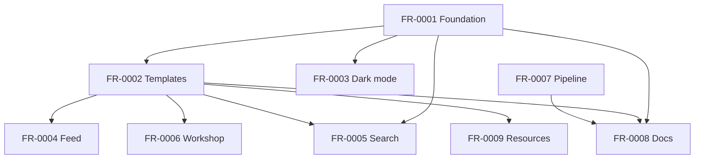

# Spec 0001 — Rust-Edu Website Revitalization

> [!info] How to use this document
> This is the **source of truth** for WHAT this revitalization builds. Stack and internal architecture are **not**
> decided here (that goes in `plan.md`).
>
> - Doubts are marked `[NEEDS CLARIFICATION: question]` — do not invent.
> - Every requirement has a stable ID (`US-NNNN`, `AC-NNNN.MM`, `FR-NNNN`, `NFR-NNNN`, `IC-NNNN.MM`) so it can be
>   referenced from plan/tasks/tests.
> - Do not move on to `plan.md` until **all** `[NEEDS CLARIFICATION]` markers are resolved or consciously accepted as
>   open.

## 1. Executive summary

The Rust-Edu website (rust-edu.github.io, served at rust-edu.org) is the public face of Rust-Edu, an organization
dedicated to supporting Rust education in academia. This revitalization rebuilds the site's presentation layer and
contribution workflow while keeping its existing static-site foundation: all externally vendored UI frameworks
(currently two CSS framework submodules) are removed in favor of hand-written styles with a modern visual refresh that
preserves the Rust-Edu brand identity, and the site gains dark mode, a news feed, client-side search, and a restored
workshop section.

The product serves three audiences: visitors (students and educators looking for Rust learning resources, news, and
workshop materials), community content contributors (who add news posts and resources through single-file pull
requests), and maintainers (who review contributions and rely on automated, reproducible deployments). The
differentiator of this revitalization is radical simplicity: zero external runtime dependencies, no database, no build
toolchain beyond the site generator already in use, and a contribution model where adding content never requires
touching templates or styles.

At a high level, the site remains a fully static site built from Markdown/data files and deployed to GitHub Pages on
every merge to the main branch. Pull requests are validated automatically (build + link checks), content contributions
are single-file changes with documented metadata contracts, and the entire revitalization lands as a sequence of small,
independently reviewable pull requests suitable for upstream adoption.

## 2. Problems and opportunities

**Main problems**

- **Contributor setup breaks on vendored frameworks** — the two CSS framework git submodules are the #1 documented
  setup failure ("Can't find stylesheet to import"); a fresh clone does not build without an extra, easily missed step.
- **Framework lock-in with a dated look** — upstream issue #1 ("Switch to Bootstrap?", open since 2022) shows
  long-standing dissatisfaction with the current CSS framework; every template is saturated with framework-specific
  class names, and framework markup has leaked into content files.
- **No way to follow the project** — upstream issue #6 (2022) asks for a follow mechanism; the site publishes news but
  offers no feed, so the only way to follow is watching the whole GitHub repository.
- **Content contributions stall** — upstream PR #3 (a book submission) has been open since 2022 and PR #9 (a course
  submission) since 2025; issue #5 notes the resources catalog has gaps. Contributors show up, but contributions are
  not easy enough to make and review.
- **Deployment is not reproducible** — the site deploys through an unpinned third-party CI action with no pinned
  generator version; latent defects exist (a search index is built but unused, an icon references a library that is
  never loaded, one template is dead code).

**Opportunities**

- Removing the framework submodules eliminates the top setup failure and resolves issue #1 by needing **no** framework
  at all — hand-written styles for a site this size are smaller, faster, and easier to maintain.
- The generator already supports feeds and search indexing natively — enabling them answers issue #6 and turns wasted
  build output into a working search feature with no external services.
- Formalizing "one file per contribution" with documented metadata contracts and automatic PR validation converts
  stalled contributions (#3, #5, #9) into mergeable single-file PRs.
- Moving to platform-official deployment actions with a pinned generator version makes every build reproducible and
  removes the third-party supply-chain dependency.

## 3. Target audience and stakeholders

**Users and stakeholders**

- **Primary user** — site visitors: students, educators, and Rust community members seeking education resources, news,
  and workshop materials.
- **Content contributor** — community members who add or update site content (news posts, resources, workshop
  materials) through pull requests.
- **Maintainer** — Rust-Edu organization leads who review pull requests, curate content, and own the deployment.
- **Other stakeholders** — the upstream rust-edu GitHub organization (receives this work as a PR series) and partner
  communities referenced by the site (e.g., Rust Africa, the Zulip community).

**Main users (personas)**

- **Elena, university educator**
  - Looks for course materials, teaching-oriented resources, and workshop proceedings she can reuse in her curriculum.
  - Visits occasionally; wants to subscribe once and be notified when something new is published.
  - Reads on both office desktop and mobile; expects legible typography and working links.
- **Tomás, CS student**
  - Wants a trustworthy, curated list of Rust learning resources ordered by topic and level.
  - Often browses at night; prefers dark mode and fast pages on mid-range hardware.
  - Uses search to jump straight to a topic instead of scanning long pages.
- **Amara, community contributor**
  - Wants to add a resource or news post without learning the site's templating or styling internals.
  - May be a first-time open-source contributor; needs copy-paste recipes and clear PR feedback when something is wrong.
  - Works only through the GitHub web UI or a minimal local setup.
- **Bart & Mordecai, maintainers**
  - Review content PRs quickly; want automation to catch build and link errors before human review.
  - Need deploys to be reproducible and safe: a broken merge must never take the live site down.
  - Prefer many small, focused PRs over large mixed ones.

**Behavioral profile**

- All personas work in the open-source/GitHub ecosystem and expect a no-login, no-tracking, fast static site.
- None of them wants to install or manage additional toolchains; simplicity beats sophistication.
- All value that content remains readable on any device and with assistive technologies.

## 4. Goals

- **Eliminate** all external UI dependencies — 0 git submodules, 0 vendored frameworks, 0 third-party requests from
  rendered pages. Measured by repository inspection and a network log of every page.
- **Reduce** contributor setup to at most 3 commands from fresh clone to running local site. Measured by executing the
  documented quickstart on a clean machine.
- **Make** news followable — a standards-valid feed is published, autodiscoverable, and linked visibly. Measured by
  feed validation (0 errors) and presence of the subscribe link.
- **Keep** the site fast and accessible — Lighthouse ≥ 95 in Performance, Accessibility, Best Practices, and SEO on the
  5 key pages (home, news list, one news post, resources, search); WCAG 2.1 AA satisfied in both themes. Measured per
  deploy on the published site.
- **Turn** content updates into single-file PRs — adding a news post or a resource touches exactly one content file and
  passes automated validation. Measured by executing both documented recipes end to end.

## 5. User stories (capabilities)

### US-0001 · Browse a modern, framework-free site

**As a** visitor, **I want** the site rendered with a fast, modern, consistent design built without external
frameworks, **so that** content is pleasant and legible on any device and the project stays easy to maintain.

Criteria:

- AC-0001.01 — Rendered pages request zero assets from third-party origins (styles, scripts, fonts, images), verified
  by a network log of each key page.
- AC-0001.02 — The repository contains no git submodules and no vendored framework code; every stylesheet is a
  hand-written project file.
- AC-0001.03 — Layout is responsive from 320 px to 1920 px viewport widths: no horizontal scrolling, images scale, and
  the navigation collapses into an accessible toggleable menu below 768 px.
- AC-0001.04 — The Rust-Edu brand identity is preserved: existing banner logo and the Rust brand palette (charcoal
  `#2a3439`, yellow `#ffc832`, red `#a72145`, green `#0b7261`, purple `#2e2459`) remain the visual base of the refresh.
- AC-0001.05 — Every interactive element is keyboard-operable with a visible focus indicator.
- AC-0001.06 — All public URLs that resolve on the current site continue to resolve after the rebuild (no broken
  permalinks).

### US-0002 · Read comfortably in dark mode

**As a** visitor, **I want** the site to follow my OS color scheme and let me override it, **so that** I can read
comfortably in any lighting condition.

Criteria:

- AC-0002.01 — On first visit, the site renders in the theme matching the OS `prefers-color-scheme` setting.
- AC-0002.02 — A theme toggle in the header switches between light and dark instantly, without a page reload.
- AC-0002.03 — A manual choice persists across pages and return visits in the same browser.
- AC-0002.04 — No flash of the wrong theme occurs on page load or navigation (the chosen theme is applied before first
  paint).
- AC-0002.05 — Both themes meet WCAG 2.1 AA contrast: ≥ 4.5:1 for body text, ≥ 3:1 for large text and UI components.
- AC-0002.06 — With JavaScript disabled, the site still follows the OS preference and the toggle is absent or inert
  without breaking the layout.

### US-0003 · Follow news via a feed

**As a** visitor, **I want** to subscribe to a feed of Rust-Edu news, **so that** I can follow the project without
watching its GitHub repository.

Criteria:

- AC-0003.01 — A feed at a stable, documented URL contains every published news post with title, publication date,
  author (when present), full content, and canonical link.
- AC-0003.02 — Every page exposes a feed autodiscovery link in its metadata so feed readers detect it from any URL.
- AC-0003.03 — The news page shows a visible "Subscribe" link pointing at the feed.
- AC-0003.04 — The feed passes the W3C Feed Validation Service with zero errors.
- AC-0003.05 — Publishing a new post (one Markdown file) adds it to the feed on the next deploy with no additional
  steps.

### US-0004 · Search the site

**As a** visitor, **I want** to search all site content from a search page, **so that** I can jump straight to a
resource, news post, or workshop page without scanning.

Criteria:

- AC-0004.01 — A search page is reachable from the navigation on every page.
- AC-0004.02 — A query of at least 2 characters returns up to 10 ranked results, each with page title, a text excerpt,
  and a working link, rendered without a full page reload.
- AC-0004.03 — A query with no matches shows an explicit "no results" state naming the query.
- AC-0004.04 — Search executes fully client-side against an index generated at build time; no request leaves the site's
  origin.
- AC-0004.05 — With JavaScript disabled, the search page explains that search requires JavaScript and offers direct
  links to the News, Resources, and Workshop sections as a fallback.
- AC-0004.06 — Search script and index are loaded only on the search page, not on any other page.

### US-0005 · Discover workshop materials

**As a** visitor, **I want** the workshop section reachable from the main navigation with its materials organized per
event, **so that** I can find proceedings, calls for participation, and paper templates.

Criteria:

- AC-0005.01 — The navigation on every page includes a Workshop entry.
- AC-0005.02 — The workshop landing page lists each event with its year and links to its materials (proceedings,
  archived call for participation, paper templates), and every listed link resolves.
- AC-0005.03 — Adding a future workshop event is a single-file addition following a documented recipe, and the new
  event appears on the landing page automatically.
- AC-0005.04 — Existing workshop asset URLs (proceedings and template files) keep resolving at their current paths.

### US-0006 · Contribute content with a single-file PR

**As a** content contributor, **I want** to add a news post or a resource by creating or editing one small file,
**so that** contributing never requires knowledge of templates, styles, or frameworks.

Criteria:

- AC-0006.01 — Adding a news post consists of creating exactly one Markdown file with a documented metadata header
  (title and date required, author optional); the post then appears on the news list, its own page, and the feed with
  no other edits.
- AC-0006.02 — Adding a resource consists of editing exactly one documented data location with an entry of at most 10
  lines (title and URL required; author and description optional; category chosen by placement); the resource then
  renders in its category on the resources page.
- AC-0006.03 — Content files contain no framework class names and no layout markup; plain Markdown plus the documented
  metadata header renders correctly.
- AC-0006.04 — A malformed content file (missing required metadata, invalid syntax) fails the pull-request validation
  with an error message identifying the file and the cause.

### US-0007 · Run the site locally in three commands

**As a** contributor, **I want** to run the site locally with the site generator alone, **so that** I can preview my
change without extra setup steps.

Criteria:

- AC-0007.01 — From a fresh clone, a running local site is reached in at most 3 documented commands, with no submodule
  initialization.
- AC-0007.02 — The README quickstart matches the actual steps and states the single pinned generator version.
- AC-0007.03 — A local build at a given commit produces the same site as the CI build of that commit (same generator
  version, same output).

### US-0008 · Trust automated deployments

**As a** maintainer, **I want** merges to the main branch to build and deploy automatically through platform-official,
version-pinned automation, **so that** deployments are reproducible and a broken change can never silently take the
site down.

Criteria:

- AC-0008.01 — A merge to the main branch triggers an automatic build and deployment using only GitHub-maintained
  actions.
- AC-0008.02 — The site generator version is pinned exactly, in a single source of truth referenced by both CI and
  documentation.
- AC-0008.03 — Every pull request runs a full site build plus an internal link check; a failure blocks the merge and
  the log identifies the cause. External link failures are reported as warnings and do not block.
- AC-0008.04 — A failed build or deployment leaves the previously deployed site live and unchanged.
- AC-0008.05 — A successful merge is live on the published site within 10 minutes.

### US-0009 · Find a curated, current resources catalog

**As a** visitor, **I want** the resources catalog to be current and curated, including pending community submissions,
**so that** I can trust it as a starting point for learning and teaching Rust.

Criteria:

- AC-0009.01 — The pending upstream submissions (the book from PR #3 and the course from PR #9) are represented in the
  catalog in appropriate categories.
- AC-0009.02 — Every catalog entry shows a title and a working URL in its category; author and description are shown
  when present.
- AC-0009.03 — Every category and subcategory heading is deep-linkable via a stable page anchor.
- AC-0009.04 — The automated link check covers the resources page: broken internal links block the PR; broken external
  links surface as warnings for curation.

## 6. Functional requirements

### 6.1 Summary table

| ID      | Requirement                                                                          |
| ------- | ------------------------------------------------------------------------------------ |
| FR-0001 | Design foundation and framework removal (US-0001, US-0007)                           |
| FR-0002 | Page template rebuild and content model contracts (US-0001, US-0006)                 |
| FR-0003 | Dark mode with system preference and manual toggle (US-0002)                         |
| FR-0004 | News feed generation and discovery (US-0003)                                         |
| FR-0005 | Client-side search page (US-0004)                                                    |
| FR-0006 | Workshop section revival (US-0005)                                                   |
| FR-0007 | Deployment pipeline modernization and PR validation (US-0007, US-0008)               |
| FR-0008 | Contributor documentation and content recipes (US-0006, US-0007)                     |
| FR-0009 | Resource catalog expansion and curation (US-0009)                                    |

### FR-0001 · Design foundation and framework removal

**Capabilities:**

- Remove both CSS framework git submodules and every reference to them; the repository builds from a fresh clone with
  no submodule step.
- Establish a single design-token set (colors, spacing scale, typography scale) defined in one place, with a light and
  a dark variant of each color token; all subsequent styling consumes these tokens.
- Preserve brand identity: existing banner logo; palette based on charcoal `#2a3439`, yellow `#ffc832`, red `#a72145`,
  green `#0b7261`, purple `#2e2459`; typography served with no third-party font delivery.
- Provide the shared page shell: header with logo and navigation, content area, footer with navigation links, external
  links, and the CC0 + source notice.
- Navigation and footer links remain configurable from the single site configuration file (label, URL, order); external
  entries open in a new tab. Changing navigation requires editing only that file.
- Responsive behavior: single breakpoint at 768 px below which the navigation collapses into a toggleable disclosure
  menu operable by mouse, touch, keyboard, and screen reader (proper button semantics and expanded/collapsed state).
- Accessibility skeleton: skip-to-content link as first focusable element, landmark regions (header, nav, main,
  footer), visible focus styles on all interactive elements.
- Delete dead presentation code: the unused template and the icon markup referencing a never-loaded icon library.
- Total hand-written CSS ≤ 50 KB uncompressed.
- All existing public URLs keep resolving unchanged.

**Experience:**

- A visitor on any device sees the branded header, reads content in a centered readable column, and reaches every
  section from the header (or, below 768 px, from the expanded menu). Keyboard users can tab through skip link →
  navigation → content → footer with a always-visible focus outline.
- A maintainer changing site navigation edits one entry in the site configuration file and sees the change reflected in
  header and footer on the next build — no template edits.

### FR-0002 · Page template rebuild and content model contracts

**Provides:**

- News post entries — title, publication date, optional author, body, canonical URL per post (consumed by FR-0004).
- Searchable content corpus — page title, body text, and URL for every indexable page (consumed by FR-0005).
- Content authoring contracts — the news post metadata header schema and the resource entry schema with its category
  structure (consumed by FR-0008, FR-0009).

**Capabilities:**

- Rebuild every page type on the FR-0001 foundation, free of framework class names: home, news list, news post,
  generic page/section, resources catalog, redirect page, and a custom 404 page.
- News list: posts ordered by publication date descending, each showing title, date, and author when present.
- News post page: title, date, author when present, and body typography for prose (headings, lists, links, images,
  code blocks with syntax highlighting for Rust examples).
- Resources catalog: renders categories and subcategories with deep-linkable anchors, each entry showing title as an
  external link plus optional author and description; external links are visually distinguishable without icon fonts.
- Redirect page type: shows a visible "you are being redirected" message with the target link while redirecting.
- Content model contracts, documented and stable: news post header (title required, date required, author optional);
  resource entry (title and URL required; author and description optional; category by placement). These contracts are
  the interface contributors code against.
- Remove framework markup currently embedded in content files; content is plain Markdown plus the documented header.
- Custom 404 page offers links to home, news, resources, and search.

**Experience:**

- A visitor scans the news list, opens a post, and reads it in a comfortable measure with consistent typography; a
  resource seeker scans categories via anchors and recognizes external links at a glance.
- A contributor adding a post copies the documented header template, writes Markdown below it, and never touches
  anything else; the post inherits all styling automatically.

### FR-0003 · Dark mode with system preference and manual toggle

**Capabilities:**

- Both themes derive from the FR-0001 token set; no component defines colors outside the tokens.
- Initial theme resolution: manual stored choice if present, otherwise OS preference, resolved before first paint (no
  flash of wrong theme).
- Header toggle switches theme instantly and stores the choice per browser; the stored choice survives navigation and
  return visits.
- Toggle control: accessible name, current state exposed to assistive technology, operable by keyboard; iconography
  drawn inline (no icon library).
- Without JavaScript: OS preference is honored via the style layer alone; the toggle does not render or is inert.
- Both themes satisfy the contrast criteria in AC-0002.05, including syntax-highlighted code blocks.

**Experience:**

- A visitor whose OS is in dark mode lands on a dark page immediately. Clicking the toggle flips the theme in place;
  every subsequent page stays in the chosen theme. Clearing browser storage returns the site to following the OS.

### FR-0004 · News feed generation and discovery

**Consumes:**

- News post entries — title, publication date, optional author, body, canonical URL (from FR-0002).

**Capabilities:**

- One Atom feed scoped to news posts at a stable URL, regenerated on every deploy, containing all published posts (no
  retention cap at current volume) with title, publication date, full content, and canonical link per entry.
- Entry author taken from the post when present; otherwise the feed-level organization author ("Rust-Edu") applies.
- Feed autodiscovery link present in the metadata of every page; visible "Subscribe" link on the news page.
- Drafts and future-dated posts excluded from the feed exactly as they are excluded from the news list.
- Output validates against the Atom standard (RFC 4287) with zero errors in the W3C Feed Validation Service.

**Experience:**

- A visitor pastes any page URL into a feed reader and the reader discovers the feed; alternatively they click
  "Subscribe" on the news page. New posts arrive in their reader after the next deploy.

**Integration criteria:**

- IC-0004.01 — Given a published news post with title, date, author, and body from FR-0002, when the site builds, then
  the feed contains an entry with that title, date, author, full content, and a canonical link that resolves.
- IC-0004.02 — Given a published post without the optional author, when the site builds, then the feed entry is still
  standards-valid and attributes the entry to the organization author.
- IC-0004.03 — Given a draft or future-dated post that FR-0002 excludes from the news list, when the site builds, then
  the feed excludes it as well.

### FR-0005 · Client-side search page

**Consumes:**

- Searchable content corpus — page title, body text, and URL per indexable page (from FR-0002).

**Essential scope:**

- Search page with input and client-side results as specified in US-0004.

**Full-scope additions:**

- The current query is reflected in the page URL, so a search can be shared or bookmarked and the page restores results
  on load.

**Capabilities:**

- A search index is generated at build time covering news posts, resources, workshop pages, and top-level pages.
- The search page loads the index and script only on that page; combined first-party script size stays within the
  site-wide 10 KB budget (the generated index is exempt from the script budget but loads only here).
- Query behavior: case-insensitive matching from 2 characters; results update as the visitor types with input settling
  (no submit required), Enter also triggers; up to 10 results ranked by relevance, each with title, an excerpt around
  the match, and the target link.
- States: idle (prompt to type), no-results (names the query), results list; all announced to assistive technology via
  a live region.
- With JavaScript disabled, the page shows the explanation and fallback section links defined in AC-0004.05.

**Experience:**

- A visitor opens Search from the navigation, types "embedded", and within the same page sees up to 10 matching pages
  with excerpts; pressing Enter or clicking a result navigates to the page. An empty or too-short query shows the idle
  prompt instead of results.

**Integration criteria:**

- IC-0005.01 — Given a news post whose title contains a distinctive word, when that word is queried on the search page,
  then the post appears in the results and its link resolves.
- IC-0005.02 — Given resources and workshop pages in the corpus from FR-0002, when a term unique to one of them is
  queried, then that page appears in the results.
- IC-0005.03 — Given the index is missing or fails to load, when the visitor opens the search page, then an explicit
  "search unavailable" state is shown instead of a silent failure.

### FR-0006 · Workshop section revival

**Essential scope:**

- Workshop entry in navigation; landing page restructured as an event list; 2022 event with all its materials.

**Full-scope additions:**

- A 2026 workshop event page — deliberately deferred (decision 2026-08-04): it ships as its own single-file content PR,
  following the documented recipe from AC-0005.03, once the 2026 call for participation is finalized.

**Capabilities:**

- The Workshop entry appears in the site navigation (FR-0001 consumes only the configuration change; no template work).
- The workshop landing page presents events newest-first, each with year, date, format, and links to its materials:
  proceedings, archived call for participation, paper templates and statement templates.
- The 2022 event is the first entry, preserving all its existing material URLs (AC-0005.04).
- A documented single-file recipe adds a future event which then appears on the landing automatically (AC-0005.03).

**Experience:**

- A visitor opens Workshop from the navigation, sees the list of events with the most recent first, and downloads
  proceedings or templates from an event's page. An educator preparing a submission finds the paper template in one
  click from the event entry.

### FR-0007 · Deployment pipeline modernization and PR validation

**Provides:**

- Build/deploy workflow facts — pinned generator version, the commands contributors' PRs are validated with, and the
  checks that run (consumed by FR-0008).

**Capabilities:**

- Deployment to GitHub Pages uses only GitHub-maintained actions; the third-party deploy action is removed.
- The site generator version is pinned exactly (current target: the version already used locally, 0.22.1) in a single
  source of truth referenced by CI; documentation cites the same source (FR-0008).
- Every pull request runs: full site build (including drafts) and the internal link check; internal failures block the
  merge. External links are checked as warnings only.
- Merges to the main branch build and deploy automatically; concurrent merges resolve to the newest deployment.
- A manual re-run/re-deploy can be triggered without pushing a new commit.
- Merge-to-live time is at most 10 minutes.

**Experience:**

- A contributor opens a PR and sees within minutes either green checks or a failed check whose log names the offending
  file. A maintainer merges and the site is live shortly after, with the deployment visible in the repository's
  environment history.

**Error handling:**

- `BUILD_FAILED_PR` — PR build fails: the check is red, merge is blocked, the log identifies file and cause; the live
  site is untouched.
- `BUILD_FAILED_MAIN` — build on main fails after merge: no artifact is published, the previous deployment stays live,
  and the failure is visible in the repository checks.
- `DEPLOY_FAILED` — build succeeds but deployment fails: the previous version remains live; the deployment can be
  re-run manually without a new commit.
- `LINK_CHECK_INTERNAL` — an internal link is broken: the build fails listing each offending link and its source file.
- `LINK_CHECK_EXTERNAL` — an external link is unreachable: a warning annotation is emitted; the build proceeds.

### FR-0008 · Contributor documentation and content recipes

**Consumes:**

- Content authoring contracts — news post header schema, resource entry schema and category structure (from FR-0002).
- Build/deploy workflow facts — pinned generator version, validation commands and checks (from FR-0007).

**Essential scope:**

- Rewritten README quickstart and a CONTRIBUTING guide with the content recipes.

**Full-scope additions:**

- A pull-request template with a short content-contribution checklist.

**Capabilities:**

- README: what the project is, quickstart in at most 3 commands (install generator at the pinned version, clone,
  serve), with no submodule step; link to CONTRIBUTING for everything else.
- CONTRIBUTING covers, each with a copy-paste example: add a news post; add a resource; add a workshop event; change
  navigation/footer links via the configuration file; preview locally; what the PR checks verify and how to read a
  failure.
- The documented examples mirror real files in the repository so they cannot silently drift from the actual contracts.
- The license/CC0 notice for content contributions is stated.

**Experience:**

- A first-time contributor reads CONTRIBUTING, copies the news-post template, edits title/date/body, opens a PR from
  the GitHub web UI, and passes checks on the first try without installing anything locally.

**Integration criteria:**

- IC-0008.01 — Given the news-post example in CONTRIBUTING, when it is copied verbatim into the news section, then the
  site builds and the post renders on the list, page, and feed (contract match with FR-0002).
- IC-0008.02 — Given the resource example in CONTRIBUTING, when it is added verbatim to the documented data location,
  then the site builds and the entry renders in the stated category (contract match with FR-0002).
- IC-0008.03 — Given the pinned generator version from FR-0007, when documentation states a version, then it references
  the same single source of truth, so the two cannot disagree.
- IC-0008.04 — Given a change to a content contract in FR-0002 or to the pinned version in FR-0007 without the matching
  documentation update, when the PR is reviewed, then the drift is detectable because the documented examples mirror
  real repository files (IC-0008.01/02 fail).

### FR-0009 · Resource catalog expansion and curation

**Consumes:**

- Content authoring contracts — resource entry schema and category structure (from FR-0002).

**Capabilities:**

- Integrate the pending upstream submissions as catalog entries: the book "The Rust Way of Programming" (upstream PR
  #3; description notes it is in Chinese) and the "Embedded Rust 101" course by Wyliodrin and Politehnica Bucharest
  (upstream PR #9), each in an appropriate existing category.
- Curation pass over the existing catalog: every entry has a working URL; descriptions are present where they add
  signal; categories keep deep-linkable anchors.
- The catalog remains open for community growth: adding an entry is the single-file recipe from FR-0008; exhaustive
  gap-filling (upstream issue #5) continues post-revitalization via community PRs.

**Experience:**

- A visitor finds the two new entries in their categories with clear descriptions. A contributor proposing the next
  resource follows the documented recipe and their PR shows green checks.

**Integration criteria:**

- IC-0009.01 — Given the resource entry schema from FR-0002, when the two new entries are added following it, then both
  render in their intended categories with title, link, author, and description.
- IC-0009.02 — Given an entry violating the schema (e.g., missing the required URL), when the PR validation runs, then
  the build fails with an error identifying the file and cause.

## 7. Non-functional requirements

| ID       | Requirement                                                                                                                                                                          |
| -------- | ------------------------------------------------------------------------------------------------------------------------------------------------------------------------------------ |
| NFR-0001 | **Zero external runtime dependencies** — rendered pages make no requests to third-party origins: no CDN assets, no external fonts, no analytics, no frameworks.                      |
| NFR-0002 | **Accessibility** — WCAG 2.1 AA across the site in both themes: contrast, keyboard operability, focus visibility, landmarks, skip link, accessible names on all controls.            |
| NFR-0003 | **Browser support** — latest 2 major versions of evergreen browsers (Chrome, Firefox, Safari, Edge) on desktop and mobile; no legacy browser support.                                |
| NFR-0004 | **Size budgets** — total hand-written CSS ≤ 50 KB uncompressed; total first-party JavaScript ≤ 10 KB uncompressed (generated search index exempt, loaded only on the search page).   |
| NFR-0005 | **Quality gate** — Lighthouse ≥ 95 in Performance, Accessibility, Best Practices, and SEO on the 5 key pages (home, news list, one news post, resources, search) on the deployed site. |
| NFR-0006 | **Toolchain simplicity** — local development requires only git and the pinned site generator (Zola 0.22.1); no additional package manager or build toolchain.                          |
| NFR-0007 | **Reproducible automation** — CI uses only GitHub-maintained actions, every action and the generator pinned to exact versions; identical inputs produce identical sites.             |
| NFR-0008 | **Progressive enhancement** — all content is readable with JavaScript disabled; script only adds convenience (theme toggle, search, menu toggle) with defined no-JS fallbacks.        |
| NFR-0009 | **Licensing continuity** — site content remains CC0; the footer license notice and the source-repository link are preserved.                                                          |
| NFR-0010 | **URL stability** — all currently public URLs keep resolving; any future rename ships a redirect from the old URL.                                                                    |
| NFR-0011 | **Incremental delivery** — the revitalization lands as a sequence of small, independently reviewable changes, each leaving the site fully buildable and deployable.                   |
| NFR-0012 | **Discoverability** — every page has a unique title and meta description; a sitemap is generated; the feed is autodiscoverable.                                                       |

## 8. Dependency graph

### Dependency table

| #   | FR      | Priority | Dependencies              |
| --- | ------- | -------- | ------------------------- |
| 1   | FR-0001 | 1        | None                      |
| 2   | FR-0007 | 1        | None                      |
| 3   | FR-0002 | 1        | FR-0001                   |
| 4   | FR-0003 | 2        | FR-0001                   |
| 5   | FR-0004 | 2        | FR-0002                   |
| 6   | FR-0005 | 2        | FR-0001, FR-0002          |
| 7   | FR-0006 | 2        | FR-0002                   |
| 8   | FR-0008 | 1        | FR-0001, FR-0002, FR-0007 |
| 9   | FR-0009 | 2        | FR-0002                   |

### Foundational features

These FRs establish shared infrastructure. In a greenfield rebuild of the presentation layer they must be implemented
sequentially, before or alongside any FR that depends on them:

- **FR-0001 Design foundation and framework removal** — removes the vendored frameworks and contributes the design
  tokens, page shell, navigation configuration, and accessibility skeleton every other FR builds on.
- **FR-0007 Deployment pipeline modernization** — contributes the pinned-toolchain CI that validates and deploys every
  subsequent change.

### Execution waves

FRs within the same wave can be built in parallel. A wave starts only when all FRs from previous waves are complete.

**Note:** when the "Foundational features" part exists, foundational FRs cannot run in parallel in a greenfield project
even if they appear together in a wave — they share scaffolding files and must be implemented sequentially until the
foundation is in place. (Here FR-0001 and FR-0007 touch disjoint areas — presentation vs. CI — so a maintainer may
choose to overlap them; the safe default is sequential.)

- **Wave 1**: FR-0001, FR-0007
- **Wave 2**: FR-0002, FR-0003
- **Wave 3**: FR-0008, FR-0004, FR-0005, FR-0006, FR-0009

### Priority levels

- **1** = Essential — the product does not work without this.
- **2** = Important — adds significant value.
- **3** = Nice to have — incremental improvement.

### Dependency diagram (Mermaid)

## 9. Out of scope

- Rewriting the site's prose (mission statement, announcement texts) beyond what template changes require.
- Internationalization / translated content.
- Analytics, telemetry, or any visitor tracking.
- Comments, user accounts, contact forms, or newsletter email delivery.
- Changes to domains or DNS (the existing custom-domain setup is preserved as-is).
- News taxonomy (tags/categories) and pagination — current volume does not need them.
- Automated archival or liveness monitoring of external resource links beyond the CI warning check.
- Authoring the 2026 workshop call for participation content and its event page (the news CFP exists; the event page
  ships as its own content PR once the CFP is finalized — resolved decision in FR-0006).
- Exhaustive resource gap-filling from upstream issue #5 — the revitalization enables it via the contribution recipes,
  but completing the catalog is ongoing community work.
- Any hosting change beyond GitHub Pages.

> [!question] Pending decisions
> Resolved 2026-08-04: the 2026 workshop event page stays out of v1 (deferred until its CFP is final — see FR-0006).
> No other out-of-scope item was promoted into v1; resource gap-filling from issue #5 continues as community PRs
> enabled by FR-0008/FR-0009.

## 10. Glossary

- **US** — User Story.
- **AC** — Acceptance Criterion.
- **FR / NFR** — Functional / Non-Functional Requirement.
- **IC** — Integration Criterion.
- **Atom** — XML-based web feed format (RFC 4287).
- **CC0** — Creative Commons Zero public-domain dedication applied to the site's content.
- **Evergreen browser** — a browser that auto-updates to its latest version (Chrome, Firefox, Safari, Edge).
- **Feed autodiscovery** — machine-readable page metadata that lets feed readers find a site's feed from any page URL.
- **GitHub Pages** — GitHub's static-site hosting, the site's existing deployment target.
- **Lighthouse** — automated audit tool scoring Performance, Accessibility, Best Practices, and SEO (0–100).
- **prefers-color-scheme** — OS/browser signal indicating the user's light/dark preference.
- **WCAG 2.1 AA** — Web Content Accessibility Guidelines 2.1, conformance level AA.
- **Zola** — the static site generator already used by this project; pinned at version 0.22.1 (NFR-0006).
- **Design token** — a named value (color, spacing, type size) defined once and consumed by all styling.
- **Upstream** — the original `rust-edu/rust-edu.github.io` repository this fork feeds via pull requests.

## 11. Spec status

- [x] All `[NEEDS CLARIFICATION]` resolved or accepted (last marker resolved 2026-08-04: 2026 workshop page deferred).
- [x] Reviewed against the constitution (`memory/constitution.md`) — not applicable: this project has no constitution.
- [x] Approved to move on to `plan.md` (owner approval, 2026-08-04).

> [!warning] Before moving on
> No `[NEEDS CLARIFICATION]` markers remain in this spec — all were resolved on 2026-08-04. This spec is approved as
> the basis for `plan.md`.
